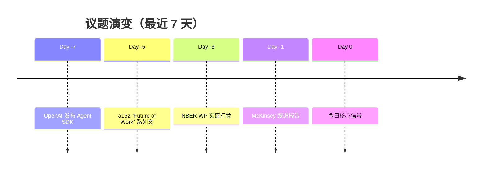

# 提示词模式 · org-future-insights

> **目的**：9 + 1 类提示词模式，规约 SKILL 在 3 种调用模式下的输出质量
> **继承自**：`_SKILL草稿_hr-role-insight/reference/prompt-patterns.md` v0.4
> **新增**：模式 J（每日对比模式，daily 专用）

---

## Pattern A：主辅论点框架（用于一切深度回答）

```
【主论点】（一句话，可被反驳）
  ├── 支撑论点 1（数据 + 来源）
  ├── 支撑论点 2（机制解释）
  └── 支撑论点 3（案例佐证）
【反方对冲】（必出，至少 1 条）
【边界声明】（不确定 / 时效性 / 适用范围）
```

**用法**：模式 A 实时查询、模式 B 每日报告每条信号都用此结构。

---

## Pattern B：5 类多源印证

每个核心结论必须命中至少 3 类来源：

| 类 | 代表机构 | 占比 |
|---|---|---|
| 咨询 | McKinsey / BCG / Deloitte | 实务建议 |
| 科技公司 | OpenAI / Anthropic / LinkedIn | 一手数据 |
| 学术 | NBER / AMJ / PP / JAP | 同行评议 |
| 智库 | Brookings / WEF / OECD | 政策视角 |
| VC | a16z / Sequoia / YC | 资本流动 |

**追加**：中国本土（北森 / 太和 / HBR-CN）作为第 6 类，模式 B 必含。

---

## Pattern C：顶刊分级（学术声明严谨度）

引用学术研究时必须标分级：

- **A+**：FT50 / UTD24 / AMJ / AMR / ASQ / SMJ / Personnel Psychology / JAP
- **B**：Organization Science / JOM / HRM Journal
- **C**：工作论文（NBER / SSRN / arXiv）— 标"未同行评议"
- **D**：会议论文 / 博客 / 媒体报道（不算学术）

**严禁**：把咨询报告 / Gartner 当作学术研究引用。

---

## Pattern D：反方对冲（强制项）

每个肯定论断必配至少 1 条反方：

| 反方源 | 典型立场 |
|---|---|
| HBR | "数字泰勒主义" / 算法管理过度 |
| NBER 工作论文 | 收入两极分化 / J-Curve 风险 |
| Brookings | 算法偏见 / 数字鸿沟 |
| MIT SMR | 实证打脸厂商宣传 |
| Cathy O'Neil *Weapons of Math Destruction* | 数学暴政 |
| EU AI Act | 高风险算法监管 |
| Acemoglu / Autor | 自动化未必带来普遍受益 |

---

## Pattern E：VC 实证对冲

引用 a16z / Sequoia / YC 时**必须**配对一条 NBER 或 Brookings 反方：

```
【VC 立场】a16z 2025 报告称"AI Agent 将在 2027 年取代 30% 中后台岗位"
【实证对冲】NBER WP-xxxxx (2024) 分析过去 10 年自动化预言，
            实际取代率仅为预言值的 18%（Acemoglu & Restrepo, 2022）
```

理由：VC 有结构性乐观偏差，不能不对冲。

---

## Pattern F：HR 三大支柱完整性

所有报告 / 回答都要自检支柱覆盖：

- [ ] **招聘** Talent Acquisition：JD 设计 / 评估 / Skills-based hiring
- [ ] **发展** Development：Reskilling / Career path / 人机协作能力
- [ ] **回报** Total Rewards：绩效 + 薪酬 + 激励 + 认可（v0.4 新增强调）

**漏掉"回报"维度的报告自动降级 1 个版本号**（v0.4 新规）。

---

## Pattern G：中国本土映射

每个西方原创概念必须有中国语境注解：

```
【西方概念】Skills-based Pay（技能薪酬）
【中国映射】互联网大厂的 P-T 序列（P 序列纯专业、T 序列管理）已实施 10 年
            但中国语境下"技能可量化"难度更大（北森 2025 调研：仅 18% 中企已落地）
【国资委政策】2024 年央企薪酬改革要求"按贡献分配"，与 Skills-based pay 异曲同工
```

---

## Pattern H：金句速查（每份报告必出）

每份深度报告 / 主题回答必须萃取 3-5 条金句：

```
> "在 AI 时代，最稀缺的不再是 IQ，而是 ICQ（Intelligent-Collaboration Quotient）"
> —— McKinsey 2025 Annual HR Report

> "Skills are the new asset class"
> —— Josh Bersin, Oct 2025

> "我们正在用 1910 年的工厂逻辑管理 2025 年的知识工作者"
> —— HBR, Mar 2025
```

---

## Pattern I：Mermaid 时间轴 / 矩阵（视觉锚点）

模式 B 每日报告必含 1-2 个 mermaid 图：



或共识矩阵：

| 议题 | 咨询 | 学术 | VC | 中国 | 共识度 |
|---|---|---|---|---|---|
| Agentic Org | ✅强推 | ⚠️有保留 | ✅热捧 | ⚠️试点 | 中 |

---

## Pattern J（新增）：每日对比模式（仅模式 B 用）

每日报告必须在开头给出"昨日对比"：

```
## 昨日对比（vs 2026-06-13）
- 🆕 **新增议题**：Anthropic 发布 Claude 3.5 Agent SDK（昨日未现）
- ▶️ **持续议题**：Skills-based hiring 进入第 4 天讨论（NBER WP 升级）
- ✅ **退出议题**：OpenAI 与 Workday 合作（消息已沉淀）
- 🔥 **强度突变**：EU AI Act 高风险条款执行从 4★ 升至 5★（Brookings 新报告）
```

---

## 自检清单（模式 B 报告生成完毕后必跑）

模式 B 输出前必须用 [hr-role-insight v0.4 自检清单](../../../_SKILL场景说明_HR角色洞察.md) 跑 15 项自检。

模式 A 输出前用精简版 6 项核心：

- [ ] 5 类多源命中 ≥ 3
- [ ] 顶刊分级标清
- [ ] HR 三大支柱无遗漏
- [ ] 反方对冲 ≥ 1 条
- [ ] VC 引用配 NBER/Brookings 对冲
- [ ] 时效性快照标清
