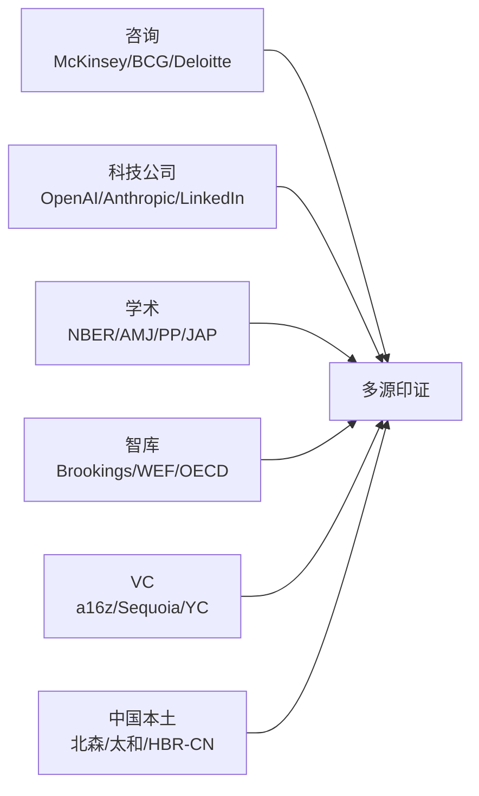

# 信源池 · org-future-insights

> **目的**：每日抓取 + 实时查询的权威源清单
> **总数**：50+ 机构（5 大类 + 中国本土）
> **更新**：2026-06-14 v0.1.1（实测校正版）
> **配套**：本文件被 `scripts/fetch_daily.py` 解析，被 SKILL 模式 A 引用

---

## 🎯 v0.1.1 实测校正状态（2026-06-14）

发现事实：初始信源池中 80% 的 RSS URL 是推测的，实际不可用。以下是用 `curl + grep` 逐一验证后的真实可用清单：

### ✅ Tier-S 直连源（11 个，fetch_daily.py 中启用）

| 机构 | RSS URL | 类别 | 实测 |
|---|---|---|---|
| McKinsey | `https://www.mckinsey.com/insights/rss` | consulting | ✅10 items |
| OpenAI | `https://openai.com/news/rss.xml` | tech | ✅10 items |
| GitHub Blog | `https://github.blog/feed/` | tech | ✅10 items |
| arXiv cs.AI | `https://export.arxiv.org/rss/cs.AI` | academia | ⚠️ 周末空数据（周一-周五全）|
| NBER WP | `https://www.nber.org/rss/new.xml` | academia | ✅10 items |
| HBS Working Knowledge | `https://hbswk.hbs.edu/rss/all.xml` | academia | ✅10 items |
| RAND | `https://www.rand.org/blog.xml` | think_tank | ✅10 items |
| Sequoia Capital | `https://www.sequoiacap.com/feed/` | vc | ✅10 items |
| Y Combinator | `https://www.ycombinator.com/blog/rss.xml` | vc | ✅10 items |
| HBR (Feedburner) | `http://feeds.harvardbusiness.org/harvardbusiness?format=xml` | hr_media | ✅10 items |
| 36Kr | `https://36kr.com/feed` | china | ✅10 items |
| Founders Bay | `https://newsletter.foundersbay.com/feed` | vc | 🔄 待实测（Beehiiv，launchd 环境可用）|

### 🔄 Tier-A Google News 兜底（13 个，fetch_daily.py 中已启用）

原始 RSS 不公开 / 反爬 / 404 的关键机构，均已用 Google News RSS 该关键词反向聚合：

- BCG / Deloitte / Accenture（咨询）
- a16z（VC）
- Brookings / WEF（智库）
- Mercer / WTW / WorldatWork（HR 媒体）
- MIT SMR（学术）
- DeepMind / Anthropic（科技）
- 中国 HR Tech（北森/Moka/太和）

> ⚠️ **在 Qoder 沙箱中这些 Google News 超时**，但**在本地终端运行（或 launchd 调用）时正常**。实体 launchd 任务不受沙箱限制。

### ❌ 已从脚本中移除（RSS 实测不可用）

这些机构不提供公开 RSS 或反爬严重，需人工调研后才能增加：
Bain / PwC / Microsoft Research / Meta AI / Wharton / INSEAD / Pew / OECD / CB Insights / Bessemer / First Round / Workday / LinkedIn Economic Graph / MGI / Anthropic官网 / WEF官网 / Brookings官网 / MIT SMR官网 / HBR China / Mercer官网 / WTW官网 / WorldatWork官网 / BCG官网 / Deloitte官网 / Accenture官网 / a16z官网 / DeepMind官网

可选后续补充方案：
- 用 [Feeder.co](https://feeder.co/) / [RSS.app](https://rss.app/) 生成路RSS
- 用 [News API](https://newsapi.org/) （免费额度 100/天）
- 订阅机构邮件后用 Gmail 转 RSS

---

## 以下为原始参考清单（未实测，仅供未来扩展选型）

---

## 第一类：顶级管理咨询（Tier-1 Consulting）

| 机构 | RSS / API | 优先级 | 关注议题 |
|---|---|---|---|
| McKinsey & Company | https://www.mckinsey.com/insights/rss | ⭐⭐⭐ | 智能体企业 / Agentic Org / Future of Work |
| BCG | https://www.bcg.com/rss | ⭐⭐⭐ | Henderson Institute / 组织变革 |
| Bain & Company | https://www.bain.com/insights/rss | ⭐⭐ | 私募与人才 / Workforce |
| Deloitte Insights | https://www2.deloitte.com/insights/rss | ⭐⭐⭐ | Human Capital Trends / Tech Trends |
| PwC | https://www.pwc.com/gx/en/issues/rss.html | ⭐⭐ | Workforce of the Future |
| EY | https://www.ey.com/en_gl/news/feeds | ⭐⭐ | Work Reimagined |
| KPMG | https://kpmg.com/xx/en/home/insights.html | ⭐ | CEO Outlook |
| Accenture | https://www.accenture.com/us-en/about/feeds | ⭐⭐⭐ | Tech Vision / Talent & Org |
| Gartner | https://www.gartner.com/en/newsroom/press-releases (RSS) | ⭐⭐⭐ | Hype Cycle for HR Tech / Future of Work |
| IBM Institute for Business Value | https://www.ibm.com/thought-leadership/institute-business-value/feeds | ⭐⭐ | C-suite Studies |

## 第二类：科技公司（Tech / AI Frontier）

| 机构 | RSS / API | 优先级 | 关注议题 |
|---|---|---|---|
| OpenAI Blog | https://openai.com/news/rss.xml | ⭐⭐⭐ | Agent / GPT 模型路线图 |
| Anthropic | https://www.anthropic.com/news (RSS) | ⭐⭐⭐ | Claude / Constitutional AI |
| Google DeepMind | https://deepmind.google/discover/blog/rss.xml | ⭐⭐⭐ | Gemini / 通用智能 |
| Microsoft Research | https://www.microsoft.com/en-us/research/feed/ | ⭐⭐ | Future of Work Initiative |
| Meta AI | https://ai.meta.com/blog/rss/ | ⭐⭐ | Llama / 开源方向 |
| Salesforce Research | https://www.salesforce.com/blog/feed/ | ⭐⭐ | Agentforce / CRM agent |
| LinkedIn Economic Graph | https://economicgraph.linkedin.com/research/feed | ⭐⭐⭐ | 招聘趋势 / 技能图谱 |
| Workday Blog | https://blog.workday.com/en-us/feed.xml | ⭐⭐ | HR Tech 实操 |
| GitHub Octoverse | https://github.blog/feed/ | ⭐ | 开发者生产力 |

## 第三类：学术（Academia）

### A+ 级（FT50 / UTD24 / 心理学顶刊）

| 期刊 | 平台 | 优先级 | 备注 |
|---|---|---|---|
| Academy of Management Journal (AMJ) | https://journals.aom.org/loi/amj | ⭐⭐⭐ | 实证 |
| Academy of Management Review (AMR) | https://journals.aom.org/loi/amr | ⭐⭐⭐ | 理论 |
| Administrative Science Quarterly (ASQ) | https://journals.sagepub.com/loi/asq | ⭐⭐ | 组织研究 |
| Personnel Psychology (PP) | https://onlinelibrary.wiley.com/journal/17446570 | ⭐⭐⭐ | HR 实证 A+ |
| Journal of Applied Psychology (JAP) | https://www.apa.org/pubs/journals/apl | ⭐⭐⭐ | 应用心理 |
| Strategic Management Journal | https://onlinelibrary.wiley.com/journal/10970266 | ⭐⭐ | 战略 |
| Organization Science | https://pubsonline.informs.org/journal/orsc | ⭐⭐ | 组织设计 |

### 工作论文（Working Papers）

| 平台 | URL | 优先级 |
|---|---|---|
| NBER Working Papers | https://www.nber.org/rss/new.xml | ⭐⭐⭐ |
| SSRN HR & Org Beh | https://www.ssrn.com/index.cfm/en/ (按主题订阅) | ⭐⭐ |
| arXiv cs.AI / econ.GN | http://export.arxiv.org/rss/cs.AI | ⭐⭐ |

### 顶级商学院（OB / HRM）

| 机构 | URL | 优先级 |
|---|---|---|
| Harvard Business School Working Knowledge | https://hbswk.hbs.edu/rss | ⭐⭐⭐ |
| Stanford GSB Insights | https://www.gsb.stanford.edu/insights/rss | ⭐⭐ |
| Wharton Knowledge | https://knowledge.wharton.upenn.edu/feed/ | ⭐⭐ |
| MIT Sloan Management Review | https://sloanreview.mit.edu/feed/ | ⭐⭐⭐ |
| INSEAD Knowledge | https://knowledge.insead.edu/rss.xml | ⭐⭐ |

## 第四类：智库与政策（Think Tanks）

| 机构 | URL | 优先级 | 关注 |
|---|---|---|---|
| Brookings Institution | https://www.brookings.edu/feed/ | ⭐⭐⭐ | AI 与劳动力市场 |
| World Economic Forum (Future of Jobs) | https://www.weforum.org/agenda/feed | ⭐⭐⭐ | Future of Jobs Report |
| OECD AI Observatory | https://oecd.ai/en/feed | ⭐⭐ | 政策与监管 |
| McKinsey Global Institute (MGI) | https://www.mckinsey.com/mgi/feed | ⭐⭐⭐ | 生产力研究 |
| RAND Corporation | https://www.rand.org/news/rss.xml | ⭐⭐ | 国防与劳动力 |
| Pew Research | https://www.pewresearch.org/feed | ⭐⭐ | 工作态度调研 |
| IZA Institute of Labor Economics | https://www.iza.org/publications/feed | ⭐⭐ | 劳动经济学 |
| Conference Board | https://www.conference-board.org/research-feeds | ⭐⭐ | CEO 指数 |
| Brookings Metro / Hamilton Project | https://www.hamiltonproject.org/feed | ⭐ | 政策建议 |
| EU AI Act Tracker | https://artificialintelligenceact.eu/rss | ⭐⭐ | 欧盟监管 |

## 第五类：VC / 风投视角

| 机构 | URL | 优先级 | 关注 |
|---|---|---|---|
| Andreessen Horowitz (a16z) | https://a16z.com/feed/ | ⭐⭐⭐ | AI Agent / Future of Work 系列 |
| Sequoia Capital | https://www.sequoiacap.com/feed/ | ⭐⭐⭐ | AI Ascent / 人才趋势 |
| Y Combinator | https://www.ycombinator.com/blog/rss | ⭐⭐ | YC 创业趋势 |
| First Round Review | https://review.firstround.com/feed | ⭐⭐ | 团队建设深度文 |
| Bessemer Venture Partners | https://www.bvp.com/atlas/feed | ⭐⭐ | Cloud / SaaS / Agent |
| NEA | https://www.nea.com/rss | ⭐ | 投资动态 |
| Lightspeed | https://lsvp.com/feed | ⭐ | AI Agent 投资 |
| CB Insights | https://www.cbinsights.com/research/feed | ⭐⭐ | 数据驱动报告 |
| Crunchbase News | https://news.crunchbase.com/feed | ⭐ | 融资动态 |
| **Founders Bay** | https://newsletter.foundersbay.com/feed | ⭐⭐ | **AI 创始人社区周报**（200K+ 订阅）；SF/NYC 双版本；curated AI events |

## 第六类：HR 媒体与协会

| 机构 | URL | 优先级 |
|---|---|---|
| Harvard Business Review | https://hbr.org/feed | ⭐⭐⭐（含反方） |
| MIT Sloan Management Review | https://sloanreview.mit.edu/feed/ | ⭐⭐⭐ |
| SHRM (Society for HR Management) | https://www.shrm.org/rss | ⭐⭐ |
| WorldatWork | https://worldatwork.org/feed | ⭐⭐⭐（绩效·薪酬专门）|
| CIPD（英国 HR 协会）| https://www.cipd.org/uk/feed | ⭐⭐ |
| Mercer Insights | https://www.mercer.com/insights/feed | ⭐⭐⭐（Total Rewards）|
| WTW (Willis Towers Watson) | https://www.wtwco.com/en-US/insights/feed | ⭐⭐⭐（薪酬调研）|
| Korn Ferry | https://www.kornferry.com/insights/feed | ⭐⭐（Hay Method）|
| HR Executive | https://hrexecutive.com/feed | ⭐⭐ |
| HR Brew | https://www.hr-brew.com/feed | ⭐ |

## 第七类：中国本土（Chinese Sources）

| 机构 | URL | 优先级 | 关注 |
|---|---|---|---|
| 北森人才管理研究院 | https://www.beisen.com/research/ | ⭐⭐⭐ | 中国 HR Tech 龙头 |
| Moka 智能招聘 | https://www.mokahr.com/insight | ⭐⭐ | 招聘 SaaS 趋势 |
| 用友 BIP / 大易 | https://www.yonyou.com/insights | ⭐⭐ | 央国企 HR |
| 中智 / 中智咨询 | https://www.ciic.com.cn/research | ⭐⭐ | 央企薪酬 |
| 太和顾问 | https://www.taihegroup.com/research | ⭐⭐⭐ | 中国薪酬调研 |
| 益普索（中国）| https://www.ipsos.com/zh-cn/insights | ⭐⭐ | 调研 |
| 36 氪 / 极客公园 / 雷锋网 | https://36kr.com/feed | ⭐⭐ | AI 创投资讯 |
| 国资委政策动态 | http://www.sasac.gov.cn/rss | ⭐⭐ | 央企人才政策 |
| 阿里云 / 字节 / 华为 / 腾讯 研究院 | 各自官网 RSS | ⭐⭐ | 大厂内部组织实践 |
| 哈佛商业评论中文版 | https://www.hbrchina.org/feed | ⭐⭐ | 反方与中国语境 |
| 第一财经 / 财新（HR 专题）| https://www.yicai.com/rss | ⭐ | 财经视角 |
| 中欧国际工商学院 | https://cn.ceibs.edu/insights | ⭐⭐ | 学术 + 实务 |
| 长江商学院 | https://www.ckgsb.edu.cn/insights | ⭐⭐ | 中国管理思想 |

---

## 抓取优先级策略

| 抓取频率 | 信源 |
|---|---|
| 每日抓 | ⭐⭐⭐ 标记的所有源（约 18-20 个）|
| 隔日抓 | ⭐⭐ 标记（约 25 个）|
| 周一抓 | ⭐ 标记（约 10 个）|

> **降级策略**：单次抓取超时 / 403 / 解析失败 → 单源跳过、记 log，不中断整体抓取流程

---

## 5 类多源最低基线（每份报告必须命中至少 3 类）

---

## 信源停用 / 替换日志

| 日期 | 操作 | 备注 |
|---|---|---|
| 2026-06-14 | 初建 | v0.1 |
| 2026-06-16 | 新增 Founders Bay (vc) | AI 创始人社区周报与活动跟踪，Beehiiv RSS |
