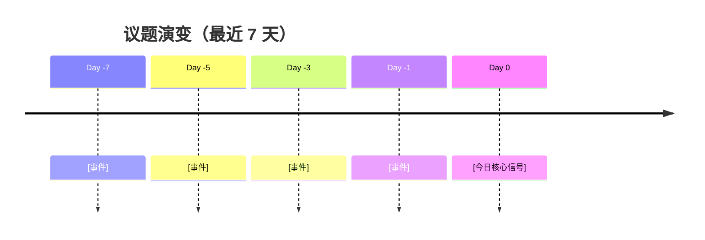

# 模板 · 每日深度报告（模式 B）

> **目标长度**：约 3000 字
> **必含元素**：mermaid 时间轴 × 1，共识矩阵 × 1，金句 3-5 条，反方对冲 ≥ 3 条
> **文件命名**：`daily-reports/YYYY-MM-DD.md`

---

```markdown
# 📅 未来组织趋势日报 · YYYY-MM-DD

> **快照时间**：YYYY-MM-DD HH:MM（抓取窗口：前 24 小时）
> **抓取源数**：50+，命中 5 类多源 N/5
> **生成路径**：org-future-insights v0.1（模式 B）

---

## 0. TL;DR（30 秒速读）

- **今日核心**：[一句话主信号]
- **强度评分**：⭐⭐⭐⭐（满 5）
- **关键变化**：[相比昨日的最大不同]
- **HR / CHRO Action**：[最该做的 1 件事]

---

## 1. 昨日对比（Pattern J）

- 🆕 **新增议题**：[今日才出现，昨日未见]
- ▶️ **持续议题**：[已连续 N 天讨论]
- ✅ **退出议题**：[已沉淀 / 不再热议]
- 🔥 **强度突变**：[关注度从 N★ 升 / 降至 M★]

---

## 2. 今日 3 条核心信号（Pattern A 主辅论点）

### 信号 1：[一句话主信号]

**【主论点】** [可被反驳的具体主张]

- **支撑 1**：[数据 / 案例 + 来源链接]
- **支撑 2**：[机制解释]
- **支撑 3**：[多源印证 — 至少 3 类来源命中]

**【反方对冲】** [HBR / NBER / Brookings 中至少 1 条]

**【中国映射】** [北森 / 太和 / 国资委 / 中国大厂实践]

**【边界声明】** 不确定项 / 时效性 / 适用范围

### 信号 2：...
（同上结构）

### 信号 3：...
（同上结构）

---

## 3. 议题演变时间轴（Pattern I · Mermaid）



---

## 4. 共识 vs 分歧矩阵（Pattern I · Matrix）

| 议题 | 咨询 | 科技公司 | 学术 | 智库 | VC | 中国 | 共识度 |
|---|---|---|---|---|---|---|---|
| [议题 1] | ✅强推 | ✅试点 | ⚠️有保留 | ⚠️监管 | ✅热捧 | ⚠️试水 | 中 |
| [议题 2] | ✅ | ⚠️ | ❌否定 | ❌ | ✅ | ⚠️ | 低（明显分歧）|

---

## 5. HR 三大支柱影响（Pattern F 完整性）

### 5.1 招聘（Talent Acquisition）
[今日信号对招聘维度的影响 + 中国语境]

### 5.2 发展（Development）
[Reskilling / 人机协作能力变化]

### 5.3 回报（Total Rewards）⭐ v0.4 强调
[绩效 / 薪酬 / 激励 / 认可的最新进展]

---

## 6. 顶刊与工作论文动态（Pattern C 分级）

### A+ 级新文（FT50 / UTD24 / 心理学顶刊）
- [AMJ / PP / JAP] [文章标题] [作者] [一句话亮点]

### 工作论文（C 级 — 未同行评议）
- [NBER WP-xxxxx] [文章标题] [一句话亮点]
- [arXiv] [文章标题] [一句话亮点]

> **学术声明严谨度**：本日报引用学术研究 N 篇，A+ 级 X 篇 / B 级 Y 篇 / C 级 Z 篇

---

## 7. VC 视角与对冲（Pattern E）

### 今日 VC 立场
- **a16z**：[立场]
- **Sequoia**：[立场]
- **YC**：[立场]

### 实证对冲
[NBER / Brookings 反方数据 — 必出]

---

## 8. 关键金句速查（Pattern H · 3-5 条）

> "[金句 1]"
> —— [来源 + 日期]

> "[金句 2]"
> —— [来源 + 日期]

> "[金句 3]"
> —— [来源 + 日期]

---

## 9. CHRO / CRO 行动建议

| 时间窗 | 行动 | 优先级 | 依据 |
|---|---|---|---|
| 本周 | [具体行动] | 高 | [今日信号 1] |
| 本月 | [具体行动] | 中 | [信号 2] |
| 本季 | [具体行动] | 低 | [信号 3] |

---

## 10. 多源印证统计（Pattern B）

| 来源类 | 命中机构 | 数量 |
|---|---|---|
| 咨询 | McKinsey, BCG, ... | N |
| 科技公司 | OpenAI, Anthropic, ... | N |
| 学术 | NBER, AMJ, ... | N |
| 智库 | Brookings, WEF, ... | N |
| VC | a16z, Sequoia, ... | N |
| 中国本土 | 北森, 太和, ... | N |
| **合计** | — | **N+** |

> **基线达标**：✅ 命中 X/5（≥3 即合规）

---

## 11. 自检（Pattern 自检清单）

- [x] 5 类多源命中 ≥ 3
- [x] 顶刊分级标清
- [x] HR 三大支柱无遗漏（含回报维度）
- [x] 反方对冲 ≥ 3 条
- [x] VC 引用配 NBER/Brookings 对冲
- [x] 时效性快照标清
- [x] 金句 3-5 条
- [x] mermaid 时间轴
- [x] 共识矩阵
- [x] 中国本土映射
- [x] CHRO/CRO 行动建议
- [x] 昨日对比

---

## 12. 待补充与诚实边界

- ⚠️ [今日抓取失败的源]
- ⚠️ [未确认 / 待求证的关键事实]
- ⚠️ [需要更多时间观察的弱信号]

---

## 13. 元数据

- **生成路径**：org-future-insights v0.1（模式 B · 每日深度报告）
- **执行时长**：约 N 秒
- **抓取源**：[scripts/fetch_daily.py](../.qoder/skills/org-future-insights/scripts/fetch_daily.py)
- **下次更新**：明日 06:00（launchd 自动）+ 你的手动 `/org-future-insights --daily`

---

> **提示**：用 mermaid 渲染需在 Docsify 站点中查看 `http://localhost:3000/#/daily-reports/YYYY-MM-DD`
```
