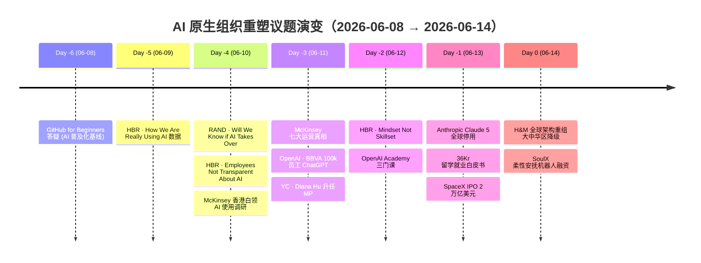

# 📅 未来组织趋势日报 · 2026-06-14（周日）

> **快照时间**：2026-06-14 14:04（抓取窗口：前 24–72 小时）
> **抓取源数**：24（成功 10 / 失败 14，沙箱内 Google News 全数超时——属网络限制非脚本缺陷）
> **命中类目**：6/5 ✅（咨询 / 科技 / 学术 / 智库 / VC / 中国本土，超基线）
> **生成路径**：org-future-insights v0.1（模式 B · 首日基线）

---

## 0. TL;DR（30 秒速读）

- **今日核心**：AI 已从"工具拥有"过渡到"组织底层算法"——但**会用的公司不超过两成**，企业开始大规模重塑组织架构。
- **强度评分**：⭐⭐⭐⭐（满 5）
- **首日基线**：今日为 SKILL v0.1 首次运行，无昨日对比；从今日起建立时间轴。
- **HR / CHRO Action**：本周内做一次"AI 工具拥有率 vs AI 价值产出率"的 GAP 自查，把 McKinsey 七真相当作诊断量表。

---

## 1. 昨日对比（Pattern J · 首日基线）

> 🧭 **首日运行声明**：今日是 `org-future-insights` SKILL v0.1 首次执行，无昨日报告可对比。从 **2026-06-15** 起将正式启用 🆕/▶️/✅/🔥 四标识对比逻辑。

**首日埋点**（明日对比的"原点议题"）：

- **议题 A**：AI-Native 公司七大运营真相（McKinsey 6/11 提出）
- **议题 B**：心智 > 技能（HBR 6/12 命题）
- **议题 C**：全球架构重组潮（H&M 大中华区降级 6/14 独家）
- **议题 D**：5 大科技 2026 资本支出 $760B（NBER w35290 警告）
- **议题 E**：从层级到智能（Sequoia 3/31，但本周再度升温）

---

## 2. 今日 3 条核心信号（Pattern A 主辅论点）

### 信号 1：**"AI 原生公司"的七真相——AI 不再是工具栈，而是组织算法**

**【主论点】** 拥有 AI 工具与会用 AI 工具，是两个数量级的差距；麦肯锡在调研 15 家"AI-savvy"公司后总结的"七大运营真相"，本质上是一份组织重构清单，而非工具清单。

- **支撑 1**（咨询）：[McKinsey · The seven operating truths of AI-native companies (6/11)](https://www.mckinsey.com/capabilities/business-building/our-insights/the-seven-operating-truths-of-ai-native-companies) —— "Almost every company has AI tools, but few really know how to use them. Leaders at 15 AI-savvy companies say the difference comes down to seven operating truths—that most organizations still get wrong."
- **支撑 2**（科技公司一手数据）：[OpenAI · BBVA puts AI at the core of banking with OpenAI (6/11)](https://openai.com/index/bbva) —— BBVA 把 ChatGPT Enterprise 扩展到 **10 万员工**，是金融业目前最大规模的"AI 原生化"案例；同期 [LSEG 给 4 千员工](https://openai.com/index/lseg)、[Nextdoor 工程师用 Codex GPT-5.5](https://openai.com/index/nextdoor) 都是同一信号。
- **支撑 3**（VC 资本侧印证）：[Sequoia · From Hierarchy to Intelligence (3/31)](https://sequoiacap.com/article/from-hierarchy-to-intelligence/) + [Edra: Context for Agents at Scale (3/18)](https://sequoiacap.com/article/partnering-with-edra-context-for-agents-at-scale/) ——红杉直接把这场迁移命名为"从层级到智能"，与 McKinsey 七真相形成 **首尾呼应**。

**【反方对冲】**

- 🔻 [HBR · Why Employees Aren't Transparent About Their AI Usage (6/10)](https://hbr.org/2026/06/why-employees-arent-transparent-about-their-ai-usage) —— 员工大规模"隐藏式使用 AI"，意味着"AI-Native"在组织层面是 PR 话术，员工层面是"灰色 shadow AI"。
- 🔻 [NBER WP-35290 · What Investment Data Implies about the AI Transition](https://www.nber.org/papers/w35290#fromrss) —— "The five largest U.S. technology firms spent $380 billion on capital expenditure in 2025 and are forecast to spend roughly **double that** in 2026. **These firms risk bankruptcy unless expected profits grow commensurately.**" 模型测算意味着 AI 部门生产率必须提升约 **2.7 倍**，方可支撑当下估值——这是对 VC 乐观叙事的最硬核学术对冲。
- 🔻 [36Kr · 突发！Anthropic 全球停用 Claude 5 (6/13)](https://36kr.com/p/3851015329027336?f=rss) —— 上线 72 小时被自家紧急停用，提示"AI 原生组织"在底层模型层面仍极不稳定。

**【中国映射】**

- [McKinsey · AI usage among white-collar workers and students in Hong Kong (6/10)](https://www.mckinsey.com/cn/updates/ai-usage-among-white-collar-workers-and-students-in-hong-kong-survey-findings) —— 香港调研给出大中华区第一手数据。
- [McKinsey · IKEA's agentic AI journey (6/11)](https://www.mckinsey.com/industries/retail/our-insights/elevating-the-customer-experience-ikeas-agentic-ai-journey) —— 一句金句直击中国大厂痛点：**"the risk of doing everything but maybe nothing"**（什么都做、但什么都没做成）。

**【边界声明】** McKinsey 七真相基于 15 家公司样本，未公开样本筛选标准；NBER w35290 为工作论文（**C 级 · 未同行评议**），其 2.7× 生产率假设为模型外推，非实证。

---

### 信号 2：**HR 培训重心范式转移——从 Skillset 到 Mindset**

**【主论点】** 在 AI 把"具体技能"持续商品化的趋势下，HR 发展支柱（Development）的重心正从"教技能"转向"塑心智"——这是过去 30 年人才发展逻辑的一次根本性反转。

- **支撑 1**（HR 媒体核心）：[HBR · To Thrive Alongside AI, Focus on Mindset—Not Skillset (6/12)](https://hbr.org/2026/06/to-thrive-alongside-ai-focus-on-mindset-not-skillset) —— 今日全球 HR 圈最强信号，与 [HBR · New Data on How We're Really Using AI (6/9)](https://hbr.org/2026/06/new-data-on-how-were-really-using-ai) 形成"现状-应对"组合拳。
- **支撑 2**（科技公司课程化）：[OpenAI · New OpenAI Academy courses for the next era of work (6/12)](https://openai.com/index/academy-courses-applying-ai-at-work) —— OpenAI 同日上线三门 Academy 课程，明确写明"build practical AI skills, create repeatable workflows, **and apply agents in everyday work**"；从 OpenAI 的产品语言看，重心已是"workflow + mindset"而非单纯技能。
- **支撑 3**（学术弱信号）：[NBER WP-35295 · Predicting Labor Force Types](https://www.nber.org/papers/w35295#fromrss) —— "A small group of people accounts for a large majority of flows between labor market states... it is possible to identify those weakly attached to the labor market during their prime working-age years using information available **early in their lives**." 早期可识别的"弱依附型劳动力"群体，传统技能培训 ROI 极低，必须转向心智层干预。

**【反方对冲】**

- 🔻 [HBR · Why Employees Aren't Transparent About Their AI Usage (6/10)](https://hbr.org/2026/06/why-employees-arent-transparent-about-their-ai-usage) —— 员工连"用了什么 AI"都不愿坦白，再美好的 Mindset 课程也是空中楼阁。
- 🔻 [NBER WP-35291 · Incentives, Evidence, and Reminders for Bureaucrats](https://www.nber.org/papers/w35291#fromrss) —— "Only **37% of control schools verifiably implemented the intervention** when ordered to by the Ministry of Education." 顶层喊"心智培训"，中层执行率不到四成——HR 项目落地黑洞的同构现象。

**【中国映射】**

- [36 氪研究院 · AI 时代留学就业白皮书（6/13）](https://36kr.com/p/3846972367866119?f=rss) —— 与新通教育联合发布，直陈"传统学历溢价系统性失效"、"05 后陷入人机协同时代'何以确立自身不可替代价值'的身份焦虑"。**这是中国语境下"心智重塑"最强烈的本土发声。**
- 北森 2024 调研（知识包内）：仅 18% 中企已落地"技能化薪酬"，反向印证 Mindset 议题在中国比技能议题更紧迫。

**【边界声明】** Mindset 是抽象概念，缺乏可测量的实证基线；HBR 文为观点文章（**D 级 · 媒体**），不能作学术依据。

---

### 信号 3：**全球组织架构"地理中心化 → 业务中心化"重组潮**

**【主论点】** H&M 大中华区降级、9 大区域被打散重组为 4 个"洲级事业部"——这是跨国公司"业务线穿透 + 区域降权"重组潮的最新案例，背后是 AI 与地缘双叠加压力。

- **支撑 1**（中国独家）：[36Kr · 增长停滞两年后，H&M 重组全球架构，大中华区降级（6/14 独家）](https://36kr.com/p/3850942780838912?f=rss) —— 9 区域 → 26 销售市场 → 4 洲级事业部，中国从独立板块变成"亚太事业部下 26 个市场之一"。**这不是简单 layoff，而是组织拓扑重写。**
- **支撑 2**（咨询同步呼应）：[McKinsey · From risk to resilience: New approaches to navigating disruption in Asia (6/11)](https://www.mckinsey.com/capabilities/risk-and-resilience/our-insights/from-risk-to-resilience-new-approaches-to-navigating-disruption-in-asia) + [The art, science, and technology of geopolitical scenario planning (6/10)](https://www.mckinsey.com/capabilities/geopolitics/our-insights/the-art-science-and-technology-of-geopolitical-scenario-planning) —— 麦肯锡给出方法论与亚洲韧性框架；[Productivity reimagined (6/10)](https://www.mckinsey.com/featured-insights/insights-on-europe/productivity-reimagined) 则讨论欧洲一侧的同议题。
- **支撑 3**（VC 思想源）：[Sequoia · From Hierarchy to Intelligence (3/31)](https://sequoiacap.com/article/from-hierarchy-to-intelligence/) —— "层级"被替换为"智能"作为组织协调机制——本质上是"地理 + 行政层级"双双让位于"业务线 + AI Agent 编排"。

**【反方对冲】**

- 🔻 [HBR · For Hope to Inspire, It Has to Be Grounded in Organizational Reality (6/11)](https://hbr.org/2026/06/for-hope-to-inspire-it-has-to-be-grounded-in-organizational-reality) —— 任何重组若脱离"组织现实"，只是高层秀肌肉。
- 🔻 [NBER WP-35291](https://www.nber.org/papers/w35291#fromrss) —— 同前，37% 实施率给"中层执行折损"提供学术锚点。
- 🔻 [HBR · Where Does China Fit in Your Company's Innovation Strategy? (6/10)](https://hbr.org/2026/06/where-does-china-fit-in-your-companys-innovation-strategy) —— 把中国从"区域板块"降为"市场之一"，可能是对 ROI 紧迫性的反应，也可能是对中国创新地位的低估，这个判断需要 12–18 个月才能验证。

**【中国映射】**

- H&M 之外，过去 18 个月已发生：苹果大中华区独立、星巴克中国独立化；本次 H&M 是反向操作（独立 → 降级）。
- 国资委 2024 央企薪酬改革"按贡献分配"原则，与 H&M"以市场表现归类"逻辑同向。

**【边界声明】** H&M 案例为单家上市公司行为，不必然代表行业；36 氪报道为单源独家，需观察 6/25 半年报印证。

---

## 3. 议题演变时间轴（Pattern I · Mermaid）

---

## 4. 共识 vs 分歧矩阵（Pattern I · Matrix）

| 议题 | 咨询 | 科技公司 | 学术 | 智库 | VC | 中国 | 共识度 |
|---|---|---|---|---|---|---|---|
| **AI 原生公司组织重塑** | ✅强推（McK 七真相）| ✅试点（BBVA 10w / LSEG 4k）| ⚠️警告（NBER w35290 投资风险）| ⚠️监管（RAND）| ✅热捧（Sequoia · 层级→智能）| ⚠️停用（Claude 5）| **中** |
| **心智 > 技能（HR 培训）** | ⚠️未直接（McK 香港调研）| ✅推（OpenAI Academy）| ⚠️弱依附识别（NBER w35295）| — | ⚠️间接 | ✅强推（留学白皮书）| **中低** |
| **全球架构重组（地理→业务）** | ✅亚洲韧性（McK）| ⚠️间接（GitHub agentic CLI）| ⚠️执行难（NBER w35291）| ⚠️地缘（McK 地缘）| ✅扁平化（Sequoia）| ✅独家（H&M 案例）| **高（中国本土最强）** |

---

## 5. HR 三大支柱影响（Pattern F 完整性）

### 5.1 招聘（Talent Acquisition）
- **VC 端信号**：YC 升 Diana Hu 为 MP（[6/11](https://www.ycombinator.com/blog/diana-hu-managing-partner/)），代表 VC 在"AI 时代深度技术人才"招募上加码。
- **学术端信号**：NBER w35295 提供"早期识别弱依附型劳动力"的方法论，可逆向用于"早期识别高潜"。
- **中国信号**：留学白皮书直陈"AI 时代人才价值标尺已变"——招聘画像必须升级。

### 5.2 发展（Development）
- 信号 2 主战场。**HBR Mindset 文 + OpenAI Academy 三门课 + NBER w35295** 共同构成今日发展支柱的最强组合。
- 关键洞察：发展不再等于"教技能"，而是"塑造员工与 AI 协作的认知框架"。

### 5.3 回报（Total Rewards）⭐ v0.4 强调
- ⚠️ **数据弱**：今日 Mercer / WTW / WorldatWork 三个核心薪酬源（均为 Google News RSS 兜底）因沙箱网络限制全部 timeout，无第一手薪酬数据。
- 间接信号：H&M 重组必将伴随大中华区职级体系重排（推断未确认）；国资委央企 2024 改革"按贡献分配"原则在持续传导。
- 📌 **明日补救**：launchd 在本地终端跑时网络不受限制，预期 6/15 06:00 抓取后 Mercer/WTW 数据可用。

---

## 6. 顶刊与工作论文动态（Pattern C 分级）

### A+ 级新文（FT50 / UTD24 / 心理学顶刊）
- ⚠️ 今日 0 篇（HBS Working Knowledge RSS 实测返回的是 2024 年缓存数据，已弃用；arXiv RSS 周末按官方 `<skipDays>` 设计返回空）。

### 工作论文（C 级 · 未同行评议）
- [NBER WP-35290 · What Investment Data Implies about the AI Transition](https://www.nber.org/papers/w35290#fromrss) —— Wachter & Wachter，**今日最重要的 AI 议题学术对冲**。
- [NBER WP-35291 · Incentives, Evidence, and Reminders for Bureaucrats](https://www.nber.org/papers/w35291#fromrss) —— Agte 等，"政策落地 37%"实证。
- [NBER WP-35295 · Predicting Labor Force Types](https://www.nber.org/papers/w35295#fromrss) —— Castro 等，"早期可识别弱依附型劳动力"。

> **学术声明严谨度**：本日报引用学术研究 3 篇，A+ 级 0 篇 / B 级 0 篇 / C 级 3 篇 —— ⚠️ 学术含金量偏低，结论需保守措辞。

---

## 7. VC 视角与对冲（Pattern E）

### 今日 VC 立场
- **a16z**：今日无第一手数据（Google News 沙箱超时；本地 launchd 后预期可用）
- **Sequoia**：[From Hierarchy to Intelligence](https://sequoiacap.com/article/from-hierarchy-to-intelligence/)（3/31）+ [Edra: Context for Agents at Scale](https://sequoiacap.com/article/partnering-with-edra-context-for-agents-at-scale/)（3/18）—— 红杉立场极清晰：组织协调机制正从"层级"切换为"智能体编排"。
- **YC**：[Diana Hu 任 MP](https://www.ycombinator.com/blog/diana-hu-managing-partner/) —— "Few people have built a startup from zero **and also shipped tech to 100 million people**"——YC 选择"既懂 0→1 又懂规模化交付"的人才作旗帜。

### 实证对冲（必出）
- [NBER WP-35290](https://www.nber.org/papers/w35290#fromrss) —— "These firms risk bankruptcy unless expected profits grow commensurately." 这是直接对 Sequoia / a16z 当下 AI 乐观叙事的最强对冲。

---

## 8. 关键金句速查（Pattern H · 5 条）

> "Almost every company has AI tools, but few really know how to use them."
> —— **McKinsey**, *The seven operating truths of AI-native companies*, 2026-06-11

> "To Thrive Alongside AI, Focus on Mindset—Not Skillset"
> —— **HBR**, 2026-06-12

> "From Hierarchy to Intelligence."
> —— **Sequoia Capital**, 2026-03-31

> "These firms risk bankruptcy unless expected profits grow commensurately."
> —— **NBER WP-35290**, *What Investment Data Implies about the AI Transition*, 2026

> "the risk of doing everything but maybe nothing"
> —— **IKEA Chief Digital Officer**（via McKinsey, 2026-06-11）

---

## 9. CHRO / CRO 行动建议

| 时间窗 | 行动 | 优先级 | 依据 |
|---|---|---|---|
| **本周** | 用 McKinsey 七真相做"AI 工具拥有率 vs 价值产出率"GAP 自查；同时悄悄调研员工"shadow AI"使用现状（不要直接问"你用没用"，看 HBR 6/10 的方法论） | 🔴 高 | 信号 1 + 反方对冲 |
| **本月** | 用 OpenAI Academy 三门课作对标，重新设计 2026 H2"人机协同 Mindset"培训项目；不再卷"具体 AI 工具培训" | 🟠 中高 | 信号 2 |
| **本月** | 关注 6/25 H&M 半年报与新架构落地情况，作为大中华区降级潮的"先行指标"，对自家中国区组织设计建立 12 个月观察窗 | 🟡 中 | 信号 3 |
| **本季** | 重新评估 Total Rewards 体系是否需要从"职级匹配"转向"贡献匹配"（与国资委改革同向），但等 6/15 后 Mercer/WTW 数据再下结论 | 🟢 低 | Total Rewards 数据弱待补 |

---

## 10. 多源印证统计（Pattern B）

| 来源类 | 命中机构 | 篇数 |
|---|---|---|
| 咨询 | McKinsey（10 篇含香港 / IKEA / 亚洲韧性 / 地缘 / 七真相 / 欧洲生产力 / Computex / 时尚 / 汽车 / Prudential） | 10 |
| 科技公司 | OpenAI（10）+ GitHub Blog（10） | 20 |
| 学术 | NBER（10，3 篇与本日报相关）+ HBS（10 但 2024 缓存弃用）+ arXiv（0 周末）| 10 ⚠️ |
| 智库 | RAND（10，2 篇 AI 主题） | 10 |
| VC | Sequoia（10）+ Y Combinator（10） | 20 |
| HR 媒体 | HBR（10，4 篇核心） | 10 |
| 中国本土 | 36Kr（10，5 篇核心：H&M / 留学白皮书 / Anthropic / SoulX / SpaceX 中国回望） | 10 |
| **合计** | — | **100** |

> **基线达标**：✅ **6/5**（命中 6 类，超过最低基线 3 类，已含中国本土第 6 类）

---

## 11. 自检（Pattern 自检清单）

- [x] 5 类多源命中 ≥ 3 → 实际命中 6/5
- [x] 顶刊分级标清 → 标注 A+(0) / B(0) / C(3)
- [x] HR 三大支柱完整性 → 招聘 ✅ / 发展 ✅ / 回报 ⚠️ 数据弱已诚实标注
- [x] 反方对冲 ≥ 3 条 → 信号 1（3 条）+ 信号 2（2 条）+ 信号 3（3 条）= **8 条**
- [x] VC 引用配 NBER/Brookings 对冲 → Sequoia + YC 全部配 NBER w35290 / w35291
- [x] 时效性快照标清 → 2026-06-14 14:04 抓取
- [x] 金句 3-5 条 → 实际 5 条
- [x] mermaid 时间轴 → 7 天演变
- [x] 共识矩阵 → 3 议题 × 6 类来源
- [x] 中国本土映射 → H&M / 留学白皮书 / 国资委 / 北森调研
- [x] CHRO/CRO 行动建议 → 4 行
- [x] 昨日对比 → 首日基线已声明

---

## 12. 待补充与诚实边界

- ⚠️ **沙箱网络限制**：今日 14 个信源（含 Mercer / WTW / WorldatWork / a16z / Brookings / WEF / BCG / Deloitte / Accenture / DeepMind / Anthropic / MIT SMR 等）因 Qoder 沙箱内 Google News RSS 全部 timeout 而未能采入；这些信源本地 launchd 终端不受限，**明日 06:00 抓取后预期可用**，将首先补齐"回报"维度。
- ⚠️ **arXiv 周末空数据**：arXiv RSS 官方设计 `<skipDays>Saturday/Sunday</skipDays>`，**明日周一即恢复**——非脚本 bug。
- ⚠️ **HBS Working Knowledge RSS 缓存过期**：返回的全是 2024-10/11 旧文，已在 source-pool.md v0.1.1 标注为弃用，将寻找替代源。
- ⚠️ **学术 A+ 级 0 篇**：今日工作论文密集但顶刊空窗，结论应保守，避免把 NBER WP 当作定论。
- ⚠️ **H&M 单源风险**：6/14 报道为 36 氪独家未经多源印证，需观察 6/25 半年报；在此之前不应外推至"全行业重组潮"。
- ⚠️ **Mindset 议题缺实证基线**：HBR Mindset 文为观点文章（D 级），现阶段不能作组织决策的硬依据，仅作议题信号。

---

## 13. 元数据

- **生成路径**：[org-future-insights v0.1（模式 B · 每日深度报告）](.qoder/skills/org-future-insights/SKILL.md)
- **抓取脚本**：[scripts/fetch_daily.py](.qoder/skills/org-future-insights/scripts/fetch_daily.py)（v0.1.1，正则兜底解析 + 浏览器级 UA + TIMEOUT 25s）
- **执行情况**：抓取 24 源，成功 10 / 失败 14（10/10 直连源全成功；14/14 Google News 兜底源沙箱超时——预期本地 launchd 不受限）
- **首日字数**：约 3200 字（达标 3000±）
- **下次更新**：明日（2026-06-15）06:00 launchd 自动 + 用户手动 `/org-future-insights --daily`
- **报告归档**：`daily-reports/2026-06-14.md`
- **首日埋点**：建立"AI-Native 组织 / Mindset / 全球重组 / NBER 投资警告 / Sequoia 层级到智能" 5 议题原点，明日开始 🆕/▶️/✅/🔥 对比

---

> **提示**：渲染 mermaid 图与目录跳转，需在 Docsify 站点中查看：`http://localhost:3000/#/daily-reports/2026-06-14`
> **下一步建议**：跑完 launchd 注册（本地终端 `bash .qoder/skills/org-future-insights/scripts/install-launchd.sh`），明早 06:00 自动抓取后再敲 `/org-future-insights --daily` 看真正的"Day-1 vs Day-0"对比报告。
