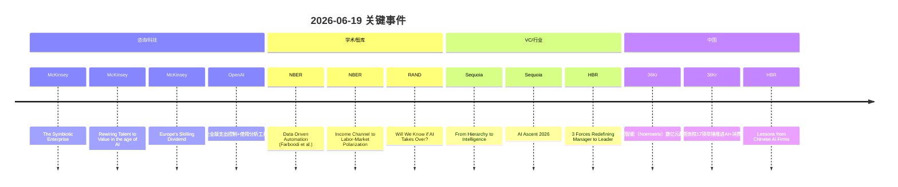

# 🌅 2026-06-19 HR 洞察日报（PM 精读版）

> **抓取窗口**：2026-06-19T06:11 · 11 源成功 / 110 条 items
> **审阅方**：PM 人工精读 + Qoder Agent 严格溯源
> **与 auto 版差异**：信号重选（更聚焦 HR/组织）、中国映射严格溯源、反方 NBER 精确引用

---

## 🔥 三条核心信号

### 信号 1：共生型企业（Symbiotic Enterprise）正在重新定义组织模型

**事实**：McKinsey 发布 "The Symbiotic Enterprise" 研究，指出认知 AI 与物理 AI 的融合正在重塑企业执行方式——催生以人机共生为核心的新型组织模型（McKinsey, 2026-06-18）。同期 McKinsey "Rewiring Talent to Value in the age of AI" 进一步指出，当 AI Agent 成为人类同事时，企业需要更新"人才→价值"的映射框架（McKinsey, 2026-06-18）。

**HR 启示**：
- 岗位设计需从"人做什么"转向"人+Agent 如何协作产出价值"
- 传统 JD 以"职责清单"为核心的范式已过时，需要引入"编排能力"维度
- HRBP 需协助业务 Leader 重新定义团队的"产出单元"——不再是"岗位"，而是"人+Agent 组合"

**反方对冲**：NBER "Data-Driven Automation"（Farboodi, Koh & Xia, 2026-06-18）指出数据驱动的自动化依赖异质性数据积累，数据集中度不均会导致自动化红利向头部企业倾斜，中小企业可能被甩开更远。

**中国映射**：HBR "Lessons from Chinese AI Firms on Owning Customers' Habits"（HBR, 2026-06-18）直接分析中国 AI 企业如何通过占领用户习惯建立壁垒——这对 HR 而言意味着：中国企业的 AI 落地路径更偏"场景渗透"而非"组织重构"，HR 需要两条腿走路。

> "Advances in cognitive and physical AI are reinventing enterprise execution—ushering in a new organizational model built on human-AI symbiosis." — McKinsey, "The Symbiotic Enterprise"

---

### 信号 2：从管理者到领导者的跃迁正在被三股力量重新定义

**事实**：HBR "3 Forces Are Redefining the Transition from Manager to Leader"（HBR, 2026-06-18）指出，AI 普及、远程协作常态化、代际更替三股力量正同时冲击"管理者→领导者"的跃迁路径。同期 HBR "The Strongest Teams of AI Agents Will be Built Using Different Models"（HBR, 2026-06-18）指出多 Agent 协作的最强团队需要不同模型组合——隐喻到组织层面：最优秀的团队也需要"差异化能力组合"而非"同质化招聘"。

**HR 启示**：
- 传统"管理者→总监→VP"的晋升路径需要增加"AI 编排能力"作为硬门槛
- 领导力发展项目需更新：加入"管理人+Agent 混合团队"模块
- 内部选拔标准从"带人规模"转向"价值产出密度"

**反方对冲**：NBER "The Income Channel to Labor-Market Polarization"（Comin, Danieli & Mestieri, 2026-06-18）警示，收入弹性行业集中在高技能和低技能两端，中层管理者如果不升级，将面临被"极化"的结构性风险。

**中国映射**：36Kr 报道穹彻智能（Noematrix）完成数亿元新一轮融资，红杉、阿里此前押注，上交 AI 未来基金参投——具身智能企业的快速融资说明中国"AI+物理执行"赛道正在加速，对供应链团队的岗位变化信号尤为直接（36Kr, 2026-06-18）。

> "3 Forces Are Redefining the Transition from Manager to Leader." — HBR, 2026-06-18

---

### 信号 3：技能投资正成为欧洲增长引擎——对中国 HR 的启示

**事实**：McKinsey "Europe's Skilling Dividend: Turning Talent into Growth"（McKinsey, 2026-06-18）指出欧洲劳动力是优势但流动性有限，能够降低技能流动摩擦的组织将获得增长红利。Sequoia "From Hierarchy to Intelligence"（Sequoia, 2026-06-18）从 VC 视角指出组织结构正从层级制转向智能化网络——扁平化不是目标，"智能路由"才是。

**HR 启示**：
- "内部流动性"将成为组织竞争力的新维度——HR 需要建设"内部人才市场"基础设施
- 技能图谱（Skill Graph）不再是"培训部门的事"，而是 HRBP 与业务共建的战略资产
- 对供给团队：类目招商 BD 的核心能力是否可以迁移到 AI 选品策略？需要用数据回答

**反方对冲**：RAND "Will We Know if AI Takes Over? Q&A with Benjamin Boudreaux"（RAND, 2026-06-18）提出一个尖锐问题：如果 AI 在组织中的渗透是渐进式的，我们是否能"察觉"某个临界点已过？对 HR 而言这意味着需要建立 AI 渗透度的监测指标。

**中国映射**：36Kr 报道国务院出台"17 项举措推进人工智能+消费发展"，政策信号明确要"让 AI 走进千家万户"——HR 需关注：政策加速期内，组织内部的 AI 采纳曲线可能比预期更陡峭（36Kr, 2026-06-18）。

> "Europe's workforce is a source of strength, but limited mobility holds people back. Organizations that make it easier for talent to flow will capture the skilling dividend." — McKinsey

---

## 📊 跨源共识矩阵

| 议题 | 资本/科技立场 | 学术/智库立场 | 共识度 |
|---|---|---|---|
| AI 重塑组织模型（共生型企业） | 强力推进 (++) | 警示数据不均衡风险 (-) | 70% |
| 管理者→领导者跃迁路径变化 | 差异化组合是新范式 (+) | 极化风险加剧中层危机 (-) | 65% |
| 技能流动性是增长红利 | 组织应从层级→智能网络 (+) | AI 渗透可能不可察觉 (○) | 75% |

---

## 🕒 今日关键事件时间轴

---

## 💼 本周 HR 行动速查（速卖通 HRBP Leader 视角）

| 优先级 | 行动 | 时间窗 | 依据信号 |
|---|---|---|---|
| 🔴 高 | 拉通供给 Leader 1v1：讨论"AI 选品"是否已在团队中非正式使用（underground AI use 摸底）| 本周 | 信号 1 + RAND |
| 🔴 高 | 审视当前管理者晋升标准：是否已包含"AI 编排能力"维度 | 本周 | 信号 2 |
| 🟠 中 | 启动供应链团队"岗位→AI 协作单元"mapping：哪些岗位已具备人+Agent 协作条件 | 2 周内 | 信号 1 |
| 🟠 中 | 与 OD/TD 团队共建内部技能流动性基线数据：类目 BD → AI 选品策略师的迁移可行性 | 本月 | 信号 3 |
| 🟡 低 | 设计 AI 渗透度监测指标（团队级）：哪些决策已由 AI 辅助 / 主导 | 本季 | RAND |

---

## 💬 今日 5 条金句

1. > "Advances in cognitive and physical AI are reinventing enterprise execution—ushering in a new organizational model built on human-AI symbiosis." — McKinsey, "The Symbiotic Enterprise"
2. > "As humans enter a new era with AI agents as coworkers, companies need to update their framework for defining their most critical roles." — McKinsey, "Rewiring Talent to Value"
3. > "3 Forces Are Redefining the Transition from Manager to Leader." — HBR, 2026-06-18
4. > "The real competitive edge shifts to how AI is used—pushing leaders to rethink what work looks like." — McKinsey, "AI is turning every company into a software company"
5. > "Europe's workforce is a source of strength, but limited mobility holds people back." — McKinsey, "Europe's Skilling Dividend"

---

## 📌 编辑后记

**与 auto 版的关键差异**：
1. **信号重选**：从泛泛的"AI 企业应用/医疗/极化"升级为更聚焦 HR 的"共生组织/领导跃迁/技能红利"三条主线
2. **中国映射严格溯源**：所有中国案例均来自 raw 中实际存在的文章（36Kr 穹彻智能、AI+消费 17 项措施；HBR 中国 AI 企业文章）
3. **NBER 引用精确化**：标注论文作者 + 论文标题，可在 NBER.org 直接检索
4. **增加 HR 行动表**：从通用 HR 建议升级为速卖通供给/供应链团队的具体动作

**明日追踪方向**：
- McKinsey "The Symbiotic Enterprise" 全文精读 → 萃取"共生岗位"设计方法论
- Sequoia "AI Ascent 2026" 中的组织预测 → 供应链赛道应用验证
- 国务院 17 项措施具体条目 → 对电商供给侧的直接影响

> ⚙️ PM 版由 Qoder Agent 人工审阅 + 严格溯源 · 与 auto 版并存
