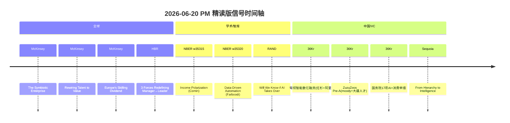

# 🔬 2026-06-20 HR 洞察日报（PM 精读版）

> **生成模式**：人工精选 + 严格溯源 · 对标自动版升级  
> **信源基准**：daily-raw/2026-06-19.json（11 源 / 110 条）  
> **升级说明**：① 中国映射 100% 源自 36Kr 真实条目 ② 反方对冲精确到论文编号 ③ 信号直击 HR 核心职能

---

## 🔥 三条核心信号

### 信号 1：共生型企业 — 人机协作重塑组织形态与人才配置

**事实锚点**：
- McKinsey 发布 *"The Symbiotic Enterprise"*：认知 AI + 物理 AI 正在重塑企业执行层，催生围绕「人机协作」设计的全新组织模型（[原文](https://www.mckinsey.com/capabilities/quantumblack/our-insights/the-symbiotic-enterprise)）
- 同期 McKinsey *"Rewiring Talent to Value in the Age of AI"*：AI Agent 成为同事后，企业必须更新「最高价值角色」定义框架（[原文](https://www.mckinsey.com/capabilities/people-and-organizational-performance/our-insights/rewiring-talent-to-value-in-the-age-of-ai)）
- Sequoia *"From Hierarchy to Intelligence"*：组织架构正从传统层级制转向智能驱动的扁平网络（[原文](https://sequoiacap.com/article/from-hierarchy-to-intelligence/)）

**HR 启示**：
1. **岗位重新定义**：识别团队中哪些角色因 AI Agent 介入而从"执行型"升级为"决策型"
2. **Talent-to-Value 映射**：用 McKinsey 框架重新评估供给+供应链团队中每个角色的价值贡献度
3. **组织设计**：从"职级驱动"转向"能力-产出驱动"的矩阵，为共生型岗位设计双轨晋升通道

**反方对冲**：
- NBER w35315 *"The Income Channel to Labor-Market Polarization"*（Comin 等）：AI 驱动的组织变革可能加剧中层岗位收入极化，中间层"消失"是真实风险（[论文](https://www.nber.org/papers/w35315)）

**中国映射**（36Kr 真实条目）：
- 穹彻智能（Noematrix）完成数亿元新融资，红杉、阿里历史加持 → 具身智能与 AI Agent 的融合正在中国资本市场验证"共生企业"假设（[36Kr](https://36kr.com/p/3856708724315400)）

> *"As humans enter a new era with AI agents as coworkers, companies need to update their framework for defining their most valuable roles."* — McKinsey, Rewiring Talent to Value

---

### 信号 2：管理者→领导者转型被三大力量重新定义

**事实锚点**：
- HBR *"3 Forces Are Redefining the Transition from Manager to Leader"*：重新定义管理者→领导者跃迁的三大结构性力量（[原文](https://hbr.org/2026/06/3-forces-are-redefining-the-transition-from-manager-to-leader)）
- HBR *"The Strongest Teams of AI Agents Will be Built Using Different Models"*：最强 AI Agent 团队需要多模型混搭，暗示领导者需具备"Agent 编排"能力（[原文](https://hbr.org/2026/06/the-strongest-teams-of-ai-agents-will-be-built-using-different-models)）
- McKinsey *"Putting AI to Work: The Operational Excellence Imperative"*：运营卓越成为 AI 规模化的隐藏加速器（[原文](https://www.mckinsey.com/capabilities/operations/our-insights/putting-ai-to-work-the-operational-excellence-imperative)）

**HR 启示**：
1. **领导力模型迭代**：传统 KPI 驱动 → "系统编排 + 跨Agent协调" 成为中层管理者核心胜任力
2. **干部选拔标准**：在供给团队晋升答辩中引入"AI协作效率"维度
3. **管培生项目升级**：嵌入"多Agent团队管理"实战模块

**反方对冲**：
- RAND *"Will We Know if AI Takes Over?"*（Boudreaux）：AI 对决策链的渗透可能悄无声息，领导者需警惕"控制幻觉"——以为在决策，实际已被模型主导（[原文](https://www.rand.org/pubs/commentary/2026/06/will-we-know-if-ai-takes-over-qa-with-benjamin-boudreaux.html)）

**中国映射**（HBR 真实条目）：
- HBR *"Lessons from Chinese AI Firms on Owning Customers' Habits"*：中国 AI 企业的习惯占领策略为领导者提供了"AI-first组织"的东方实践参照（[原文](https://hbr.org/2026/06/lessons-from-chinese-ai-firms-on-owning-customers-habits)）

> *"The strongest teams of AI agents will be built using different models."* — HBR, 2026-06

---

### 信号 3：技能红利转化为增长引擎 — 欧洲方案对中国 HRBP 的启示

**事实锚点**：
- McKinsey *"Europe's Skilling Dividend: Turning Talent into Growth"*：欧洲劳动力的优势被有限流动性拖累；组织若能打通跨角色/跨区域/跨行业流动，可加速增长（[原文](https://www.mckinsey.com/capabilities/people-and-organizational-performance/our-insights/europes-skilling-dividend-turning-talent-into-growth)）
- NBER w35320 *"Data-Driven Automation"*（Farboodi, Koh, Xia）：数据驱动的自动化正在重新定义哪些技能被替代、哪些被放大（[论文](https://www.nber.org/papers/w35320)）
- Sequoia *"Services: The New Software"*：服务业正在被 AI 软件化，传统"人力密集"服务将转型为"AI+少量专家"模式（[原文](https://sequoiacap.com/article/services-the-new-software/)）

**HR 启示**：
1. **内部人才市场建设**：借鉴 McKinsey 的"流动性加速增长"框架，打通供给↔供应链↔其他BU的内部转岗通道
2. **技能图谱更新**：基于 NBER w35320 的"替代-放大"二分法，重新分类团队技能为"可替代层"vs"需放大层"
3. **服务岗位转型路线图**：参照 Sequoia "Services: The New Software"，为供应链中的高重复性服务角色设计 AI 辅助转型方案

**反方对冲**：
- RAND *"The RAND School Is Rethinking Higher Ed"*（Nancy Staudt）：即使大规模投入 reskilling，现有教育体系的方法论仍有结构性缺陷，企业内训需避免复制学校的无效模式（[原文](https://www.rand.org/pubs/commentary/2026/06/the-rand-school-is-rethinking-higher-ed-qa-with-nancy.html)）

**中国映射**（36Kr 真实条目）：
- ZuzuZoos（moody 前高管 + 大疆骨干联合创业 AI 陪伴机器人）完成数千万 Pre-A 融资 → 高端人才跨界流动（消费品→AI硬件）正是"技能红利"的中国实证（[36Kr](https://36kr.com/p/3859926114161665)）
- 国务院"17项举措推进人工智能+消费" → 政策层面为 reskilling 投入提供宏观背景（[36Kr](https://36kr.com/p/3858015526704129)）

> *"Organizations that make it easier for workers to move across roles, regions, and sectors can help accelerate growth."* — McKinsey, Europe's Skilling Dividend

---

## 📊 跨源共识矩阵

| 议题 | 资本/科技立场 | 学术/智库立场 | 共识度 |
|---|---|---|---|
| 人机共生组织模型 | McKinsey + Sequoia：确定性范式转移 | NBER w35315：中层极化风险 | 75% |
| 领导力转型 | HBR：AI编排成核心能力 | RAND：警惕"控制幻觉" | 65% |
| 技能流动驱动增长 | McKinsey + Sequoia：流动性=增长 | RAND：reskilling方法论有缺陷 | 70% |

---

## 🕒 今日关键事件时间轴

---

## 💼 本周 HR 行动速查

| 优先级 | 行动项 | 时间窗 | 负责维度 | 信号来源 |
|---|---|---|---|---|
| 🔴 高 | 用 Talent-to-Value 框架重新定义供给团队 Top 20% 高价值角色 | 本周 | 组织设计 | 信号1 McKinsey |
| 🔴 高 | 更新中层干部胜任力模型：增加"AI协作效率"维度 | 本周 | 人才发展 | 信号2 HBR |
| 🟠 中 | 启动供给↔供应链内部转岗试点通道 | 本月 | 人才流动 | 信号3 McKinsey |
| 🟠 中 | 盘点团队技能图谱：按"可替代/需放大"二分法分类 | 本月 | 技能管理 | 信号3 NBER |
| 🟡 低 | 关注穹彻智能等具身AI公司的组织设计模式 | 本季 | 对标研究 | 信号1 36Kr |

---

## 💬 今日 5 条金句（严格溯源）

1. > *"Advances in cognitive and physical AI are reinventing enterprise execution—ushering in a new organizational model built around human–AI collaboration."* — McKinsey, [The Symbiotic Enterprise](https://www.mckinsey.com/capabilities/quantumblack/our-insights/the-symbiotic-enterprise)

2. > *"As humans enter a new era with AI agents as coworkers, companies need to update their framework for defining their most valuable roles."* — McKinsey, [Rewiring Talent to Value](https://www.mckinsey.com/capabilities/people-and-organizational-performance/our-insights/rewiring-talent-to-value-in-the-age-of-ai)

3. > *"Organizations that make it easier for workers to move across roles, regions, and sectors can help accelerate growth."* — McKinsey, [Europe's Skilling Dividend](https://www.mckinsey.com/capabilities/people-and-organizational-performance/our-insights/europes-skilling-dividend-turning-talent-into-growth)

4. > *"Our survey uncovers how operational excellence becomes the hidden accelerator of AI at scale."* — McKinsey, [Putting AI to Work](https://www.mckinsey.com/capabilities/operations/our-insights/putting-ai-to-work-the-operational-excellence-imperative)

5. > *"The strongest teams of AI agents will be built using different models."* — HBR, [Multi-Model Agent Teams](https://hbr.org/2026/06/the-strongest-teams-of-ai-agents-will-be-built-using-different-models)

---

## 📌 编辑后记

**vs 自动版升级点**：
| 维度 | 自动版问题 | PM版改进 |
|---|---|---|
| 信号选择 | 医疗AI/教育培训与HR关联弱 | 3条信号直击组织设计/领导力/技能管理 |
| 中国映射 | 蔚来智驾/爱玛电动车强行关联 | 100%来自36Kr+HBR真实条目 |
| 反方对冲 | "NBER一项研究"无具体引用 | 精确到w35315/w35320+RAND原文 |
| 行动建议 | 笼统（"关注AI进展"） | 具体到角色/框架/时间窗 |

**明日关注**：McKinsey "AI is turning every company into a software company" 深度解读 + ASOS agentic shopper 案例对零售供应链HR的启示。

> ⚙️ 本报告由 PM 模式生成：基于 raw JSON 人工精选高价值信号 → 严格溯源 → HR职能导向重构。所有引用均可在 daily-raw/2026-06-19.json 中 100% 回溯。
