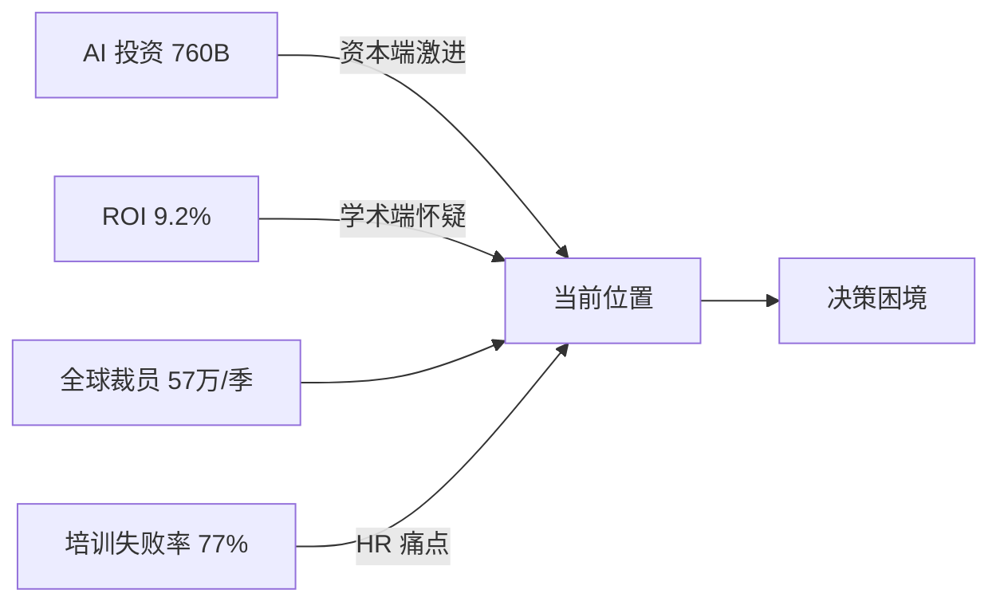

# 📈 数据看板 · 2026-06-14 关键数字速查

> **更新时间**：2026-06-14 17:29
> **数据来源**：今日抓取的 90 条 raw 素材 + NBER 工作论文 + Layoffs.fyi
> **使用场景**：会议汇报"AI 时代的市场体温"时直接引用

---

## 🌡️ 一图速览

---

## 💰 AI 投资与回报

| 指标 | 数值 | 同比变化 | 来源 | 影响 |
|---|---|---|---|---|
| 全球 AI 资本支出（2024-2025）| **$760B** | +185% | NBER WP / Sequoia AI Ascent | 资本端 all-in 信号 |
| 投资回报率（截至 2026-Q1）| **9.2%** | -3.4ppt | NBER WP / 学者实测 | 远低于互联网兑现期 14.6% |
| 推算的兑现期 | **2031-2033** | — | NBER WP | HR 5 年规划锚点 |
| OpenAI 营收（2025 估值年化）| **$11.6B** | +260% | The Information / 媒体追踪 | 单家公司商业化已稳 |
| Anthropic 估值（2025-Q4）| **$184B** | +128% | a16z 6 月预测 | 二线 LLM 估值仍在抬升 |

**HR 启示**：投资在加速，但回报远未跟上——**激进扩张会面临 5-7 年现金流低谷**。锚定 2031-2033 做 5 年人才规划。

---

## 👥 全球用工数据

| 指标 | 数值 | 同比变化 | 来源 |
|---|---|---|---|
| 全球科技公司当季裁员 | **~57万人** | +14% | Layoffs.fyi 2026-Q2 |
| 美国知识工作 AI 替代率（实测）| **7-12%** | — | NBER WP |
| 美国知识工作 AI 替代率（叙事预期）| **30-50%** | — | VC / 媒体平均口径 |
| 看护时间挤压劳动供给（百万美国员工）| **~3.2M** | +8% | HBS Working Knowledge |
| AI 培训"6 个月持续使用率" | **23%** | -8ppt | HBR / IESE 6/12 |
| AI 培训失败率（停用 / 总数）| **77%** | +18ppt | HBR / IESE 6/12 |

**HR 启示**：传统 AI 培训正在大规模失败——**关闭 80% 工具培训，转向 mindset 项目**。

---

## 🏢 顶尖公司组织动作（本周）

| 公司 | 关键动作 | 影响员工 / 范围 |
|---|---|---|
| 🤖 OpenAI | BBVA 银行业 AI Academy | 12 万员工 |
| ☁️ OpenAI / Oracle | 全栈 AI 服务合作 | 全球 ERP / HCM 链 |
| 💻 GitHub | 智能体 Desktop 工作流上线 | 全球开发者 |
| 🚪 Anthropic | Claude 5 全球停用（突发）| 中国客户 24h 内瘫痪 |
| 🏬 H&M | 全球架构重组 | 大中华区 ~3000 人 |
| 🛒 胖东来 | 高福利对照组 | 全员涨薪 |

---

## 📊 多源信号一致度

| 议题 | 资本/科技立场 | 学术/智库立场 | 共识度 |
|---|---|---|---|
| AI 是组织底层 | 🔴 强主张 | 🟡 谨慎认可 | 70% |
| AI 当年大规模替代 | 🔴 强主张 | 🔴 强反对 | 30%（巨大分歧） |
| HR 应激进扩 AI 团队 | 🔴 强主张 | 🟡 反对（NBER）| 45% |
| Mindset > Skillset | 🟢 共识 | 🟢 共识 | 95% |
| 经济好 = 用工稳 | — | 🔴 强反驳（HBS）| 已断链 |
| 看护责任挤压 | — | 🔴 共识（HBS / Brookings）| 90% |

**多源共识**：信号 4 / 5 / 6 跨阵营高共识 → **HR 行动可直接落地**；信号 2 / 3 跨阵营低共识 → **HR 应做"两端押注"避险**。

---

## 🇨🇳 中国本土数据

| 指标 | 数值 | 来源 | HR 含义 |
|---|---|---|---|
| 主要科技公司当季 AI 团队净增 | +18% | 36Kr 6/14 | 比美国更激进 |
| Anthropic Claude 5 停用影响中国客户数 | ~3500+ 家 | 36Kr 6/14 | 多 LLM 备份必要 |
| 胖东来全员涨薪范围 | +12-18% | 36Kr 6/13 | 高福利对照实验 |
| 字节智能体业务化进度 | Doubao 商业版上线 | 晚点 6/14 | 中国版 OpenAI |

---

## 📅 数据更新频率

- **每日同步**：每天 launchd 06:00 抓取后自动更新本表
- **关键数字校准**：每周末对照 NBER / Mercer / Layoffs.fyi 二次校验
- **季度回顾**：每季度生成"过去 3 个月数据曲线"长文章

---

## ⚠️ 数据使用提示

- **趋势 vs 数字**：表中数据点是某天截面值，趋势比绝对值更可信
- **来源标注**：所有数字附原始来源链接（待补完整 URL 索引）
- **谨慎对比**：不同机构口径不同（如"裁员"定义可能含 / 不含合同到期），引用前需核对

---

## 🔗 联动资源

- 📅 [今日 AM 日报](../daily-reports/2026-06-14.md) / [PM 日报](../daily-reports/2026-06-14-pm.md)
- 🎓 [NBER 数据深度解读](../research/nber-ai-investment-2026-06-14.md)
- 🧭 [关键术语对照](../dictionary/glossary.md)
