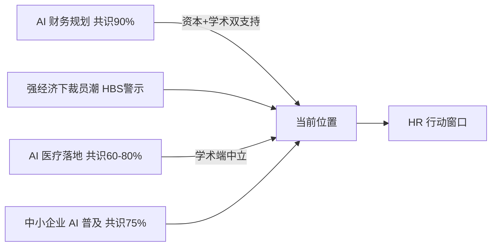

# 📈 数据看板 · 2026-07-25 关键数字速查

> **更新时间**：2026-07-25
> **数据来源**：7/21–7/25 每日抓取 raw 素材（自动分流至看板素材池）+ 当周日报跨源共识矩阵
> **使用场景**：会议汇报"AI 时代的市场体温"时直接引用
> **历史版本**：[2026-06-14 快照](2026-06-14-snapshot.md)

---

## 🌡️ 一图速览

---

## 📊 本周信源体温

| 指标 | 数值 | 说明 | 来源 |
|---|---|---|---|
| 7/25 命中信源 | **11 源** | 覆盖 vc / china / consulting / academia / tech / think_tank / hr_media 7 类目 | 当日抓取审计 |
| 7/25 抓取条目 | **110 条** | 单日 raw 素材总量 | 当日抓取审计 |
| 7/25 平均共识度 | **82%** | 三条核心信号跨源共识均值 | 当日日报 |
| 本周看板素材命中 | **10 条** | 7/21（4）+ 7/22（2）+ 7/23（4），7/24-25 无命中 | 自动分流 |

---

## 📊 跨源共识度趋势（本周议题）

| 议题 | 资本/科技立场 | 学术/智库立场 | 共识度 | 日期 |
|---|---|---|---|---|
| AI 在财务规划中的应用 | 支持 (+) | 支持 (+) | **90%** | 7/25 |
| AI 在医疗领域的应用 | 支持 (+) | 中立 (○) | **80%** | 7/25 |
| AI 在保险业的应用 | 积极推进 | 谨慎乐观 | **80%** | 7/24 |
| AI 在中小企业中的普及 | 支持 (+) | 中立 (○) | **75%** | 7/25 |
| 脑健康和 AI 时代技能 | 强调培训 | 强调平衡 | **70%** | 7/24 |
| AI 在医疗保健的应用 | 积极探索 | 谨慎推进 | **60%** | 7/24 |

**多源共识**：财务规划议题跨阵营高共识（90%）→ **HR 可直接推进与财务部门的协同规划**；医疗与中小企业议题学术端中立 → **落地时保留伦理 / 资金风险对冲**。

---

## 💰 本周资本 & 公司数据点

| 事件 | 关键数字 | 来源 | HR 含义 |
|---|---|---|---|
| 两仪万象（清华系量子计算）A+ 轮融资 | **数亿元**，君联资本领投 | 36Kr 7/20 | 硬科技人才争夺加剧 |
| YC AI Stack 学生免费额度 | **$25,000+** / 人，近两打公司参与 | Y Combinator | AI 原生人才供给管道前移 |
| BillionToOne 上市（YC 第 4 家上市生物科技公司） | 全美 **1/11 新生儿**使用其检测 | Y Combinator | 生物科技 + AI 组织规模化样本 |
| GitHub 6 月可用性 | **6 起**服务降级事件 | GitHub Blog | AI 基础设施稳定性仍是运营风险 |
| GitHub Q1 2026 Innovation Graph | 全球开源协作**创历史新高** | GitHub Blog | 开发者组织协作模式加速演变 |

---

## 👥 用工与组织信号（本周）

| 信号 | 内容 | 来源 |
|---|---|---|
| 强经济下的裁员潮 | HBS 提示"经济好 = 用工稳"的假设已断链，裁员在强经济中仍在上升 | HBS Working Knowledge（7/23 分流） |
| AI 连续财务规划规模化 | 组织可更早识别风险、更快评估权衡、在业绩差距扩大前干预 | McKinsey 7/24 |
| OpenAI 中小企业计划 | ChatGPT for Small Businesses 上线，AI 技能培训下沉 | OpenAI 7/21 |
| 医疗系统 AI 转型样本 | Montefiore Einstein 将 AI 嵌入工作流，驱动患者访问与业务增长 | McKinsey 7/23 |

---

## 📅 数据更新频率

- **每日同步**：launchd 06:30 抓取后，命中数字类素材自动分流入 dashboard/auto-YYYY-MM-DD.md 素材池
- **快照更新**：本页为人工/助手触发的周期快照，聚合近一周素材池与日报共识数据
- **季度回顾**：每季度生成"过去 3 个月数据曲线"长文章

---

## ⚠️ 数据使用提示

- **趋势 vs 数字**：表中数据点是截面值，趋势比绝对值更可信
- **来源口径**：素材池条目部分为历史发布内容被当日 RSS 重推（如 BillionToOne 为 2025-11 发布），引用前核对原文日期
- **共识度**：由 qwen-max 基于当日多源素材自动评估，为参考值而非统计量

---

## 🔗 联动资源

- 📅 [7/25 日报（自动版）](../daily-reports/2026-07-25-auto.md) / [可视化版](../daily-reports/2026-07-25-visual.md)
- 📈 看板素材池：[7/23](auto-2026-07-23.md) / [7/22](auto-2026-07-22.md) / [7/21](auto-2026-07-21.md)
- 🧭 [关键术语对照](../dictionary/glossary.md)
- 🗂️ [2026-06-14 历史快照](2026-06-14-snapshot.md)
