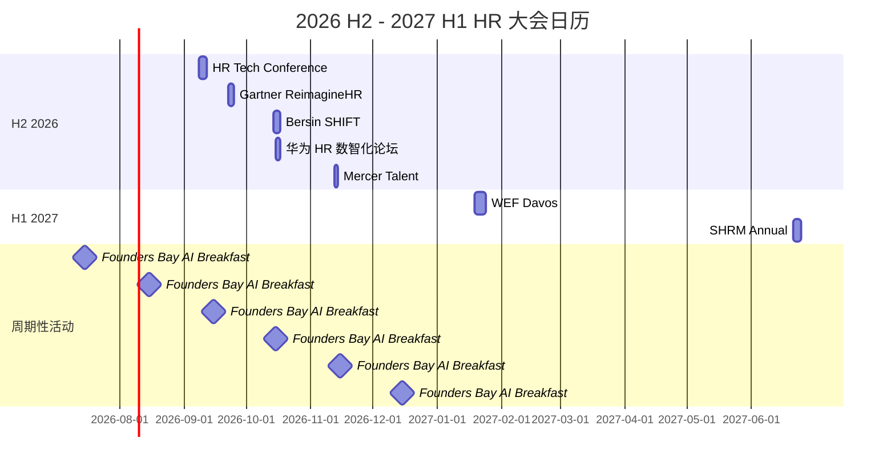

# 📅 2026 H2 · 全球 HR / 组织 大会议程速查

> **使用场景**：HR 同事每月 / 每季排会议时知道**哪场不能错过**、**哪场可以略过**、**哪场值得我们派人**。

---

## 🌟 必参加（高优先级 ⭐⭐⭐）

### HR Tech Conference 2026

- **时间**：2026-09-08 ~ 09-11
- **地点**：美国 · 拉斯维加斯
- **主题**：AI in HR / People Analytics / Future of Work
- **HR 价值**：⭐⭐⭐ 全球 HR 科技领域最大年度盛会
- **必听议程**：
  - Sept 9 · Day 1 Keynote · Josh Bersin "Mindset > Skillset" 实证报告
  - Sept 10 · 智能体企业 panel（OpenAI / Anthropic / Workday）
  - Sept 11 · CHRO 圆桌：HR 5 年规划与 AI 兑现期
- **媒体跟踪**：HBR / Mercer / Bersin Academy 现场报道
- **建议**：派 1-2 名 HR 数字化负责人现场；其他订阅 livestream

### Bersin SHIFT 2026

- **时间**：2026-10-14 ~ 10-16
- **地点**：美国 · 圣安东尼奥
- **主题**：HR Excellence / Talent Strategy / Workforce Planning
- **HR 价值**：⭐⭐⭐ Bersin Academy 旗舰会，**HR 战略级议题最全**
- **必听议程**：
  - Day 1 · Bersin 主旨演讲 *The Agentic Enterprise: 5-Year HR Roadmap*
  - Day 2 · 失败案例工作坊（含 H&M 重组 / Anthropic 停用应对）
- **建议**：CHRO 同事亲自参加；HRBP 团队订阅录播

### Mercer Global Talent Trends Summit 2026

- **时间**：2026-11-12 ~ 11-13
- **地点**：英国 · 伦敦
- **主题**：年度 Global Talent Trends 报告发布 + 全球 CHRO 峰会
- **HR 价值**：⭐⭐⭐ Mercer 年度报告**首发**现场
- **必拿到**：现场领取的 *Global Talent Trends 2027* 完整报告（早于公开版 6 个月）

---

## 🟢 可选参加（中等优先级 ⭐⭐）

### Gartner ReimagineHR 2026

- **时间**：2026-09-22 ~ 09-24
- **地点**：美国 · 奥兰多 / 英国 · 伦敦（双会场）
- **主题**：HR Tech / Future of Work / People Analytics
- **HR 价值**：⭐⭐ Gartner 视角偏 IT，HR 同事抓**技术供应商比较**最有用
- **建议**：科技人才 / IT-HR 协同同事参加

### SHRM Annual Conference 2026

- **时间**：2026-06-29 ~ 07-02（已结束）
- **下届**：2027-06 · 美国 · 凤凰城
- **HR 价值**：⭐⭐ 美国 HR 行业最大但偏行业 / 合规话题
- **建议**：派合规、薪酬、福利同事参加

### WEF Annual Meeting 2027（达沃斯）

- **时间**：2027-01-19 ~ 01-23
- **地点**：瑞士 · 达沃斯
- **HR 价值**：⭐⭐ 不直接 HR 但发布 *Future of Jobs 2027* 报告
- **建议**：订阅 WEF newsletter 跟踪报告即可

---

## 🇨🇳 中国本土会议

### 华为 HR 数智化论坛 2026

- **时间**：2026-10（具体日期待发布）
- **地点**：深圳
- **HR 价值**：⭐⭐⭐ 中国本土最大 HR 数字化会议，华为 / 阿里 / 腾讯 CHRO 共同分享
- **建议**：必参加

### 北森未来工作论坛 2026

- **时间**：2026-11
- **地点**：上海
- **HR 价值**：⭐⭐ 北森产品 + 中国 HR SaaS 生态
- **建议**：HR 数字化 / SaaS 选型同事参加

### 国资委 / 人社部 主办的 HR 数智化研讨会

- **时间**：2026 H2 多次
- **地点**：北京
- **HR 价值**：⭐⭐ 国企 HR 同事必参加（政策风向）
- **建议**：国企 HR 同事密切关注

### Founders Bay · AI Breakfast with VCs 🆕

- **时间**：每月 1 次（具体日期见 [Luma 日历](https://luma.com/foundersbay)）
- **地点**：美国 · 旧金山（SoMa / Marina / Financial District 轮换）
- **主办**：[Founders Bay](https://foundersbay.com/) · Mariane Bekker
- **HR 价值**：⭐⭐ 硅谷 AI 创始人 + VC 的一线交流，**VC 投资方向 = HR 未来岗位需求风向标**
- **形式**：
  - 🥐 月度 AI Breakfast with VCs（免费 / VIP）
  - 🍽️ 季度 VIP Founder Dinner（仅 VIP 会员）
  - 🍻 不定期 AI Happy Hour（全开放）
  - 💻 每周 Virtual Workshop（Zoom，全球可参加）
- **Newsletter**：每周日发布（SF / NYC 双城版），200K+ 订阅
- **订阅**：[newsletter.foundersbay.com/subscribe](https://newsletter.foundersbay.com/subscribe)
- **活动日历**：[luma.com/foundersbay](https://luma.com/foundersbay)
- **建议**：订阅免费 newsletter 跟踪 AI 创投趋势；若有出差 SF 计划可预约参加 AI Breakfast

---

## 📺 远程参加 / 订阅 livestream（高性价比 ⭐⭐⭐）

| 会议 | 形式 | 费用 |
|---|---|---|
| HR Tech 2026 | Keynote livestream 免费 | $0 |
| Bersin SHIFT | Recordings 在 Bersin Academy（订阅制）| ~$2.5K/年 |
| Mercer Summit | 报告下载（注册免费）| $0 |
| Gartner ReimagineHR | Gartner 客户免费 | 已订阅 |

**HR 建议**：90% 价值在**报告 / Keynote 录像 / 报名注册即可拿到的资料**——**不一定要现场出差**。

---

## 📅 整年 HR 大会日历

---

## 📰 周期性 Newsletter & 社区订阅

| 社区 / 简报 | 频率 | 订阅链接 | HR 价值 |
|---|---|---|---|
| **Founders Bay · Edge of AI** | 每周日 | [subscribe](https://newsletter.foundersbay.com/subscribe) | ⭐⭐⭐ AI 创投生态一线信号 |
| WEF Future of Jobs | 不定期 | [weforum.org](https://www.weforum.org/focus/the-future-of-jobs/) | ⭐⭐ 政策与劳动力市场 |
| Bersin Academy | 每周 | [joshbersin.com](https://joshbersin.com/) | ⭐⭐⭐ HR 战略 |

---

## 💡 HR 出差预算建议

- **CHRO**：年度选 2-3 场（Bersin SHIFT 必去 + 华为论坛 必去 + Mercer 选去）
- **HRBP / Tech HR**：年度选 1 场（HR Tech 或 Gartner）
- **薪酬福利同事**：SHRM Annual + Mercer Summit
- **合规 HR 同事**：当地法规会议 + WEF newsletter

---

## 🔗 联动资源

- 📅 [每日日报跟踪会议预告](../daily-reports/2026-06-14-pm.md)
- 🏢 [出差期间关注 OpenAI / 字节等公司动态](../companies/README.md)
- 📚 [会议发布的报告会被收录到延伸阅读](../readings/README.md)

---

## 📌 议程更新原则

- **6 个月滚动**：本日历每月更新一次，保持下个 6 个月议程完整
- **会议结束后归档**：会议结束 30 天内补"现场要点速递" 1 篇文档
- **新会议接入**：行业出现新的 HR 重磅会议时入库（v0.2.2 自动化扫描中）
