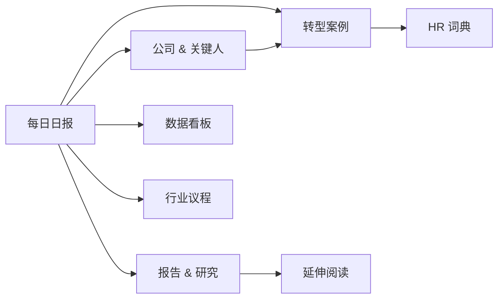

# 📋 板块说明 · 8 大内容板块速览

> 本页汇总"组织演变"知识库 8 大板块的定位、使用场景与更新频率，方便你快速了解整个系统的结构。

---

## 1. 📅 每日日报

| 项目 | 说明 |
|---|---|
| **定位** | 每日自动生成的 HR 视角趋势洞察，3 条核心信号 + 跨源对冲 + 行动速查 |
| **内容形态** | 自动版（百炼 qwen-max 生成）→ 可视化版（mermaid + 卡片布局）→ PM 精读版（人工深挖） |
| **更新频率** | 每日 06:30 自动生成；PM 精读版按需触发 |
| **适合谁看** | 全体 HR 同事（自动版通读）；HRBP Leader / CHRO（PM 精读版） |
| **使用方式** | 打开可视化版速览 → 感兴趣的信号深挖 → 行动速查直接执行 |

---

## 2. 🏢 公司 & 关键人

| 项目 | 说明 |
|---|---|
| **定位** | 追踪全球顶尖科技公司、咨询机构、新一代 AI 公司的**组织变革实践** + 关键人物言论与立场 |
| **内容来源** | OpenAI / GitHub / Anthropic / 字节跳动 / 阿里 / Microsoft 等官方博客、财报、媒体新闻 |
| **关键人物** | Sam Altman · Satya Nadella · Reid Hoffman · Josh Bersin · Garry Tan · 程维 |
| **更新频率** | 公司动态每周更新；关键人物每月汇总 |
| **使用场景** | 提案时引用标杆实践；向上汇报时引用关键人物判断；追踪竞争对手组织动态 |

---

## 3. 🎓 报告 & 研究 ⭐

| 项目 | 说明 |
|---|---|
| **定位** | 聚合全球顶级研究机构的 AI / 组织 / 人才主题工作论文、行业报告、白皮书 |
| **主要来源** | NBER 工作论文 · McKinsey / Mercer / BCG / Deloitte 季报 · HBS Working Knowledge · Brookings / WEF 智库 |
| **更新频率** | NBER 每周扫描；咨询机构季报当期入库；学术 Working Knowledge 每周扫描 |
| **使用场景** | 建立宏观锚点（AI 投资回报周期）；校准公司判断（benchmark 数据）；反方对冲依据 |
| **阅读建议** | CHRO → NBER + McKinsey；HRBP → HBS WK + Mercer；HR 学习者 → 智库报告入门 |

---

## 4. 📊 转型案例

| 项目 | 说明 |
|---|---|
| **定位** | 收录全球企业 AI / 组织转型的具体案例，按"成功 ✅ vs 失败 ❌ vs 进行中 ⏳"三维分类 |
| **案例结构** | 背景 & 动因 → 关键举措 → 结果 → HR 启示 → 反方观点 → 延伸阅读 |
| **更新频率** | 重大事件当日入库；标杆案例季度回顾；失败案例 6 个月后回访 |
| **使用场景** | 内部提案引用"X 公司这样做"；推动变革引用"Y 公司这样翻车"；设计方案参考"Z 公司的节奏" |

---

## 5. 📚 延伸阅读

| 项目 | 说明 |
|---|---|
| **定位** | 精选 HBR / NBER / McKinsey 等权威媒体的重要原文，提供"原文 + 翻译 + 导读"三件套 |
| **内容类型** | 学术论文 · 主题深度报告 · 咨询白皮书 · VC 趋势文章 · 中文媒体精选 |
| **文档结构** | 📝 编辑导读（5 句话）→ 🌐 英文原文 → 🇨🇳 中文翻译 → 💡 HR 视角点评 |
| **更新频率** | 顶刊新文发布当周入库；每月精选 1 篇最常引用重磅文章回访 |
| **使用场景** | 直接引用原句（提案/内训）；理解完整论证；给老板看英文原标题 |

---

## 6. 🧭 HR 词典

| 项目 | 说明 |
|---|---|
| **定位** | 12 个 AI 时代核心术语中英对照，60 秒速查 + 引用源 |
| **收录原则** | 词条 ≤ 30，只收录 HR 同事 90 天内会高频遇到的术语 |
| **词条结构** | 中文名 → 定义 → 典型语境 → HR 启示 |
| **更新频率** | 新增来源：每月 NBER / HBR / McKinsey 新概念；旧词条：6 个月无引用则归档 |
| **使用场景** | 开会引用、JD 设计、内部沟通术语统一、写方案时快速查阅 |

---

## 7. 📈 数据看板

| 项目 | 说明 |
|---|---|
| **定位** | 关键数据指标速查，包含行业趋势数据、投资数据、劳动力市场变化等定量信息 |
| **内容来源** | McKinsey 调查数据 · WEF 报告 · Mercer 薪酬趋势 · VC 投融资数据 · 劳动力市场统计 |
| **更新频率** | 每日自动聚合含数据的信号；季度更新基线快照 |
| **使用场景** | 向上汇报用数据说话；对标行业 benchmark；预算规划数据依据 |

---

## 8. 📅 行业议程

| 项目 | 说明 |
|---|---|
| **定位** | 全球 HR / AI / 组织领域重要会议、峰会、发布会日历 |
| **覆盖范围** | YC Demo Day · 36Kr WAVES · HRTech China · Gartner ReimagineHR · Davos / WEF · 各大厂开发者大会 |
| **更新频率** | 半年度日历基线 + 每日自动追踪新增活动 |
| **使用场景** | 提前规划参会 / 观摩；追踪大会核心议题和嘉宾发言；安排团队学习日程 |

---

## 🔗 板块联动关系

| 联动场景 | 路径 |
|---|---|
| 日报信号涉及某公司 | 日报 → 公司 & 关键人 |
| 日报引用某研究 | 日报 → 报告 & 研究 → 延伸阅读 |
| 案例涉及新术语 | 转型案例 → HR 词典 |
| 日报数据需验证 | 日报 → 数据看板 |
| 即将有相关大会 | 日报 → 行业议程 |

---

> 💡 **提示**：本系统每日 06:30 自动运行百炼 pipeline（抓取 → 日报 → 分流 → 可视化 → 审计），你只需在早晨打开浏览器即可看到最新内容。
