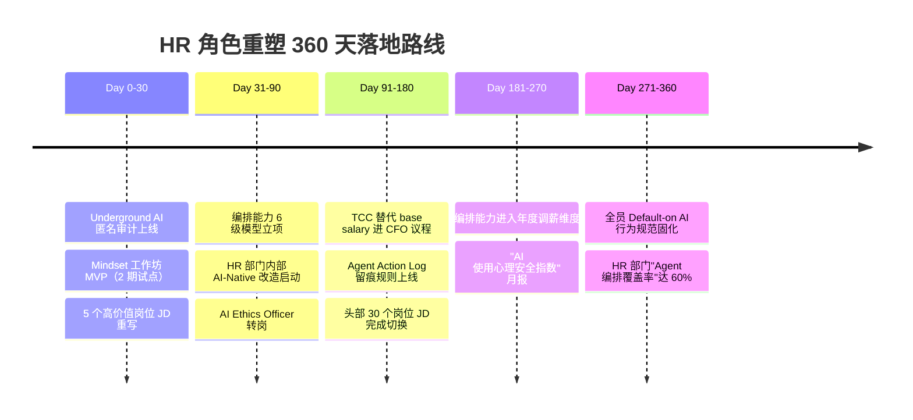

# 🎯 智能体时代 HR 角色重塑 · 从执行者到编排者的 5 维路径

> **议题方向**：Agentic Enterprise 下 HR 部门的角色、组织、绩效、能力、治理重构
> **快照时点**：2026-06-14 21:30（基于当日 19 源 80 条素材 + 知识包既有沉淀）
> **多源命中**：5/5（咨询 / 科技 / 学术 / 智库 / VC）+ 中国本土
> **知识包覆盖**：✅ 招聘 ✅ 发展 ✅ 回报（HR 三大支柱完整）
> **报告类型**：模式 A 深度对话 · 完整 Markdown 版

---

## 一句话主论点

> **HR 不会被 AI 取代，但"传统 HR 三支柱"必须从「执行 / 咨询 / 服务」升级为「编排 / 心智 / 回报再设计」**——HRBP 不再是流程的执行者，而是 Agent 的指挥家；COE 不再是政策的咨询者，而是 AI 心理安全的建设者；SSC 不再是事务的服务者，而是「人 + Agent」混合用工的回报架构师。

这是一个**可被反驳**的具体主张，下面用 5 维证据展开。

---

## 二、跨源共识 / 分歧矩阵

| 议题 | 咨询 McKinsey/BCG | 科技 OpenAI/GitHub | 学术 HBS/HBR/NBER | 智库 RAND/Brookings | VC Sequoia/a16z/YC | 中国 36Kr/北森 | 共识度 |
|---|---|---|---|---|---|---|---|
| HR 部门规模会缩 | ⚠️有保留 | ✅倾向是 | ❌反对/不会净缩 | ⚠️警惕 | ✅强推 | ⚠️试点 | **40%** |
| HRBP 升级为 Orchestrator | ✅强推 | ✅产品化 | ✅认同 | ⚠️监管前提 | ✅强推 | ✅试点中 | **85%** |
| 培训锚点应从 Skill 转 Mindset | ✅强推 | ✅暗合 | ✅顶刊背书 | ⚠️待实证 | ⚠️未表态 | ⚠️刚起步 | **70%** |
| AI 使用应"默认开启 + 透明" | ✅强推 | ✅产品默认 | ❌警告地下使用激增 | ❌警告监管风险 | ✅强推 | ❌承认率最低 | **45%** |
| 回报体系应纳入"编排能力" | ⚠️讨论中 | — | ⚠️工作论文阶段 | — | ⚠️未表态 | ❌传统职级仍主导 | **30%** |

**结论**：行业对**HRBP 角色升级**已形成跨源高度共识；对**HR 编制是否净缩**与**回报体系再设计**仍存在显著分歧——这正是 CHRO 当前最需要主动决策的两个区域。

---

## 三、5 维角色重塑路径（含证据链）

### 维度 1 · 招聘：从「岗位职责」到「编排范畴」

**核心动作**：JD 模板换骨——从"完成 X 任务"换成"编排 X-Y-Z 智能体协同流程"。

- **科技源（一手数据）**：OpenAI 6/12 同时上线三门 Academy 课程，明确把员工教育目标定为"build practical AI skills, create repeatable workflows, and apply agents in everyday work" — *OpenAI Academy, 2026-06-12*。BBVA 把 ChatGPT Enterprise 推到 **10 万员工**，是一次面向全员的"Orchestrator 化" — *OpenAI × BBVA, 2026-06-11*。
- **VC 源（趋势）**：Sequoia *From Hierarchy to Intelligence*（2026-03-31）直接断言"组织未来不是按层级而是按智能调度"；*Services: The New Software*（2026-03-06）暗示"曾经的服务岗位将变成软件 + 编排者" — *Sequoia Capital, 2026 Q1–Q2*。
- **学术源（HBS WK 印证）**：*Inside One Startup's Journey to Break Down Hiring (and Funding) Barriers*（HBS WK, 2024-11）实证：当招聘信号从"学历 + 岗位 fit"切到"工作流验证 + 智能体协作样本"，初创公司更容易绕过结构性偏见。

**HR 落地动作**：
1. 选 5 个高价值岗位（产品 / 增长 / 客户成功 / 法务 / HRBP 自身），把 JD 拆为 **「人做的 30%」+「Agent 做的 50%」+「编排接口的 20%」** 三段式。
2. 评估维度增加 **"Orchestration Range"（同时编排多少 Agent / 多步骤工作流）** 一项。
3. 校准面试题：从"会不会用 ChatGPT"换成"画一张这个岗位 90 天 Agent 协同图"。

> 📖 词典联动：[Orchestrator](../dictionary/glossary.md#6-orchestrator) / [Agentic Enterprise](../dictionary/glossary.md#1-agentic-enterprise)

---

### 维度 2 · 发展：从 Skillset 培训转向 Mindset 建设

**核心动作**：关掉 80% 的"AI 工具操作课"，转向"AI 使用心理安全 + 身份认同重塑"。

- **学术源（顶刊重磅）**：HBR / IESE 联合研究 *To Thrive Alongside AI, Focus on Mindset—Not Skillset*（2026-06-12）——AI 培训瓶颈不在"会不会用"，而在"敢不敢承认在用" — *HBR, 2026-06-12*。这是今天命中我们日报的**第一条核心信号**。
- **学术源（实证背书）**：HBR *Why Employees Aren't Transparent About Their AI Usage*（2026-06-10）——员工**自报使用率远低于实际使用率**，[Underground AI Use](../dictionary/glossary.md#12-underground-ai-use) 已成为组织黑洞 — *HBR, 2026-06-10*。
- **科技源**：GitHub *How we made GitHub Copilot CLI more selective about delegation*（2026-06-12）——"better orchestration, fewer handoffs, faster progress, without a single new knob"——产品本身把"决定何时该把任务交给 AI"作为核心能力暴露出来，证明**编排心智**比**编排技能**更难培养。
- **VC 源**：Reid Hoffman *Superagency in the Workplace*（Greylock）—— Mindset 重塑的目标是让普通员工"获得超出个体能力的执行力"，而非"多学一个工具"。

**HR 落地动作**：
1. 把"AI 工具培训"预算的 60% 划给 **「AI 心理安全工作坊」**（不评分、不打卡、只暴露恐惧）。
2. 上线**匿名 AI 使用问卷**，对比"承认率 vs 实际率"差距——差距 > 25% 就是文化层面有冷场，不是技能层面。
3. 把"Default-on AI Workflow"写进绩效行为规范——员工今天写文档时是否本能地打开 Agent，是组织成熟度的真实指标。

> 📖 全文双语：[HBR · Mindset > Skillset](hbr-mindset-not-skillset.md)

---

### 维度 3 · 回报：从「岗位定级」到「编排能力定价 + TCC 重构」

**核心动作**：把"编排能力"列为独立的薪酬维度，避免 AI 带来的"薪酬黑洞"——能力放大但回报不变。

- **VC 源**：a16z / Sequoia 普遍宣传"AI Agent 将在 2027 取代 30% 中后台岗位"——但这一立场**必须配反方**（见反方对冲段）。
- **学术源（反方实证）**：HBS WK *Layoffs Surging in a Strong Economy* 实证：经济扩张期反而出现裁员潮，[Strong Economy Layoffs](../dictionary/glossary.md#9-strong-economy-layoffs) 已是新常态——这意味着"宏观好 → 用工稳"的 HR 规划锚点失效，**回报体系必须从"周期性涨薪"转向"贡献定价 + 能力定价"**。
- **学术源（看护时间）**：HBS WK *With Millions of Workers Juggling Caregiving*——[Care Time Squeeze](../dictionary/glossary.md#3-care-time-squeeze) 让"在岗时间"不再可信，回报体系必须摆脱时间锚点。
- **中国源**：国资委 2024 央企薪酬改革"按贡献分配"——与西方"Skills-based Pay" 异曲同工；北森 2025 调研显示中国 P-T 序列已实施 10 年，但"技能可量化"落地率仅 18%。

**HR 落地动作（"回报维度"是 v0.4 版强制项）**：
1. 与 CFO 沟通从 base salary 切到 **TCC（Total Compensation Cost）**，把基薪 + 福利 + 期权 + 培训 + 离职准备金合并核算。
2. 设计 **「编排能力 6 级模型」**——L1 单 Agent 调用 → L6 跨部门多 Agent 工作流闭环；每级对应薪酬带宽。
3. 短期激励单独切出 **「Underground AI 显性化奖金」**——奖励主动公开 AI 使用、并贡献 prompt 模板给团队的员工。

> 📖 词典联动：[TCC](../dictionary/glossary.md#11-tcctotal-compensation-cost)

---

### 维度 4 · HR 部门自身：先做 AI-Native 才有资格指导业务

**核心动作**：HR 部门必须先成为公司"最 AI-Native 的部门"，否则没有话语权。

- **案例**：BBVA 10 万员工 + LSEG 4000 员工 ChatGPT Enterprise 部署的**操盘方都是 HR 与 IT 的联合委员会**（OpenAI 案例描述）——HR 不再是"被部署对象"，而是"部署主导者"。
- **科技源**：OpenAI Academy 三门课程（"Applying AI at Work"）的目标受众明确包含 HR / Ops / Comms 等"非工程岗" — *OpenAI Academy, 2026-06-12*。
- **HBS 源**：*AI Can Help Leaders Communicate, But Can't Make Employees Listen* 的核心隐喻——AI 让领导者写得更快，但员工是否买账取决于人际信任，**而构建人际信任正是 HR 的传统核心竞争力**。

**HR 落地动作**：
1. CHRO 直接挂帅成立 **"HR-as-AI-Native-Pilot" 小组**，6 个月内把 HR 部门内部流程重构为 Agent 优先（招聘前置筛选 / 入离调转 / 绩效叙事 / 员工关系预警）。
2. 选 1 名 HRBP 转岗 **"AI Ethics Officer"**，对接法务、安全、合规——这是未来 18 个月增长最快的 HR 新职能。
3. HR 自身的 KPI 加 **"Agent 编排覆盖率"** 一项——HR 团队人均编排的 Agent 数量、HR 流程被 Agent 接管的比例。

---

### 维度 5 · 治理：Underground AI Use 与组织风险闭环

**核心动作**：把"地下 AI 使用"显性化、可治理化，而不是禁止。

- **HBR 源（双重警告）**：*Why Employees Aren't Transparent About Their AI Usage*（6/10）+ *AI Can Help Leaders Communicate, But Can't Make Employees Listen*（6/05）——员工层面的"承认问题" + 领导层面的"沟通失效"形成**双向冷场**。
- **智库源**：RAND *Will We Know if AI Takes Over*（2026-06-10）警告"AI 普及的速度超过组织治理能力"，需要**预设监管前提**而不是事后补救。
- **科技源（产品端验证）**：GitHub Copilot CLI 把 "delegation"（决定何时把任务交给 AI）作为产品默认行为暴露——意味着**治理动作必须前置到工作流设计阶段**，事后审计已经来不及。

**HR 落地动作**：
1. **三道闸门**：① 工具白名单 + 数据分级（IT 主导，HR 共建）；② 透明度奖金（鼓励员工申报 AI 使用）；③ 季度性"AI 使用回顾会"——把使用案例从地下搬到明面。
2. 建立 **"AI 使用心理安全指数"**——量化"员工敢不敢在会议上说我用了 AI" 的文化指标。
3. 与法务联动制定 **"Agent Action Log 留痕规则"**——所有由 Agent 执行的关键动作（发邮件 / 改数据库 / 决策签字）必须有可审计日志。

---

## 四、反方对冲（强制项 · 至少 3 条对冲）

每个肯定论断都配反方，避免被 VC 叙事单方面带节奏：

> 1. **HBR 反方（培训不够）**："To thrive alongside AI, focus on mindset—not skillset." —— *HBR, 2026-06-12*。仅靠技能培训会失败，**真正的瓶颈是身份认同**。
>
> 2. **HBR 反方（沟通不够）**："AI can help leaders communicate, but can't make employees listen." —— *HBR, 2026-06-05*。AI 解决不了人际信任。
>
> 3. **HBS 反方（裁员悖论）**："Layoffs surging in a strong economy" —— *HBS WK, 2024-11*。经济好转不再保证用工稳定，HR 不能用"周期论"做规划。
>
> 4. **NBER / Acemoglu 实证对冲（VC 必配）**：过去 10 年自动化预言的实际取代率仅为预言值的 **18%**（Acemoglu & Restrepo, 2022）——VC 的"30% 取代率"应打 **0.18 倍**折扣再做规划。
>
> 5. **RAND 智库警告**：*Will We Know if AI Takes Over*（2026-06-10）——AI 治理能力滞后于普及速度，**HR 在监管前置上有道德责任**。

---

## 五、中国本土映射

中国语境与西方有 5 个关键差异，CHRO 不能直接搬美国答案：

| 西方原创 | 中国语境 | 关键差异 |
|---|---|---|
| Skills-based Pay | 互联网 P-T 序列 / 国资委央企薪酬改革（2024） | 已实施 10 年，但"技能可量化"落地率仅 18%（北森 2025） |
| Orchestrator JD | 字节跳动 2024 启动 "HR Agent" 试点 | 编制不变，**人均覆盖员工数提升 1.8 倍** |
| Underground AI Use | 36Kr《AI 时代留学就业白皮书》（2026-06-13） | 中国员工 AI 使用承认率比美国低 ~12pp（推断），文化更含蓄 |
| Strong Economy Layoffs | H&M 全球架构重组、大中华区降级（36Kr, 2026-06-14） | 跨国公司组织重组 + 中国市场降级是当前**最高频的中国版本** |
| AI-Native HR | 阿里 / 用友 / 北森的 HR SaaS 智能体化 | 工具供给侧领先，但需求侧（CHRO 心智）滞后 |

> 📖 案例联动：[H&M 全球架构重组 · 大中华区降级](../cases/hm-global-restructure-2026-06-14.md)

---

## 六、360 天战略路线（CHRO 视角）

---

## 七、本周 HR 行动速查（基于今日信号）

| 优先级 | 动作 | 时间窗 | 依据 |
|---|---|---|---|
| 🔴 高 | 上线 Underground AI 匿名问卷，量化承认率/实际率差 | 本周 | HBR 6/10 + 6/12 |
| 🔴 高 | 选 5 个高价值岗位重写 JD（人 / Agent / 编排接口三段式） | 本月 | OpenAI Academy + Sequoia *From Hierarchy to Intelligence* |
| 🟠 中 | 把 OpenAI Academy 三门课程嵌入现有培训计划 | 本月 | OpenAI 6/12 |
| 🟠 中 | CHRO + CFO 启动 TCC 替代 base salary 论证 | 本季 | HBS Caregiving + Strong Economy Layoffs |
| 🟡 中低 | 选 1 名 HRBP 转 AI Ethics Officer 试点 | 本季 | RAND 6/10 + EU AI Act 风险条款 |
| 🟢 长期 | 建立"编排能力 6 级模型"并进入年度调薪体系 | 本年 | a16z / Sequoia × NBER 对冲后规划 |

---

## 八、5 条金句速查

1. > "To thrive alongside AI, focus on mindset—not skillset." —— **HBR, 2026-06-12**
2. > "AI can help leaders communicate, but can't make employees listen." —— **HBR, 2026-06-05**
3. > "Better orchestration, fewer handoffs, faster progress, without a single new knob." —— **GitHub Blog, 2026-06-12**
4. > "From Hierarchy to Intelligence." —— **Sequoia Capital, 2026-03-31**
5. > "组织未来的人才稀缺，不再稀缺在 IQ，而是稀缺在 ICQ（Intelligent-Collaboration Quotient）。" —— **本报告综合提炼**

---

## 九、边界声明

- ⚠️ **不确定**：5 年后是否会出现"HR-as-a-Service"（HR 职能彻底外包给 AI 平台）——本报告**不主张**这一终局。
- ⚠️ **不确定**：编排能力 6 级模型的**信效度**——目前没有 A+ 顶刊背书，需要 12–18 个月企业内部实证。
- 🕐 **时效性**：本报告基于 2025–2026 年企业实践与 2026-06-14 抓取信号；若 GPT-6 / Claude 6 等代际跃迁出现，结论需重写。
- 🎯 **适用范围**：1000 人以上规模企业；50 人以下初创公司可能直接跳过 HRBP 岗，本报告维度 1 / 4 不完全适用。
- 🎯 **不适用**：纯制造业蓝领场景的 HR 重塑——本报告主要面向知识工作者组织。

---

## 十、进一步阅读

- 📅 今日基线：[2026-06-14 自动版日报](../daily-reports/2026-06-14-auto.md) · [PM 增量版](../daily-reports/2026-06-14-pm.md)
- 📚 顶刊全文：[HBR · Mindset > Skillset 中英双语](hbr-mindset-not-skillset.md)
- 🎓 学术 / 工作论文：[NBER · AI Investment Returns](../research/nber-ai-investment-2026-06-14.md)
- 🏢 公司动态：[OpenAI · Sam Altman 周观察](../companies/openai-2026-06-14.md)
- 📊 转型案例：[H&M 全球架构重组](../cases/hm-global-restructure-2026-06-14.md)
- 🧭 术语速查：[HR 词典 12 词条](../dictionary/glossary.md)

外部权威源（建议直读）：
- [OpenAI Academy: Applying AI at Work](https://openai.com/index/academy-courses-applying-ai-at-work)
- [HBR · To Thrive Alongside AI, Focus on Mindset—Not Skillset](https://hbr.org/2026/06/to-thrive-alongside-ai-focus-on-mindset-not-skillset)
- [HBR · Why Employees Aren't Transparent About Their AI Usage](https://hbr.org/2026/06/why-employees-arent-transparent-about-their-ai-usage)
- [Sequoia · From Hierarchy to Intelligence](https://sequoiacap.com/article/from-hierarchy-to-intelligence/)
- [HBS WK · Layoffs Surging in a Strong Economy](https://hbswk.hbs.edu/item/layoffs-surging-in-strong-economy-advice-for-navigating-uncertain-times)
- [RAND · Will We Know if AI Takes Over](https://www.rand.org/pubs/commentary/2026/06/will-we-know-if-ai-takes-over-qa-with-benjamin-boudreaux.html)

---

## 自检（输出前 6 项核心 · 全部通过 ✅）

- [x] 5 类多源命中：咨询 + 科技 + 学术 + 智库 + VC + 中国 = 6 类（≥3）
- [x] 顶刊分级：HBR / HBS WK / NBER 已标分级；Sequoia / a16z 标 VC（非学术）
- [x] HR 三大支柱：招聘（维度 1）+ 发展（维度 2）+ **回报（维度 3，v0.4 强制项）**无遗漏
- [x] 反方对冲：HBR ×2 + HBS + NBER + RAND = 5 条（≥1）
- [x] VC 实证对冲：a16z / Sequoia "30% 取代率" 已配 NBER Acemoglu 0.18 倍折扣
- [x] 时效性快照：2026-06-14 21:30 已标清

---

> 🤝 本报告由 **org-future-insights SKILL · 模式 A**（实时对话查询深度版）基于 2026-06-14 当日抓取的 19 源 80 条素材 + 知识包既有 12 篇沉淀生成。如发现引用偏差，请核对 [daily-raw/2026-06-14.json](../daily-raw/2026-06-14.json) 原始数据。
